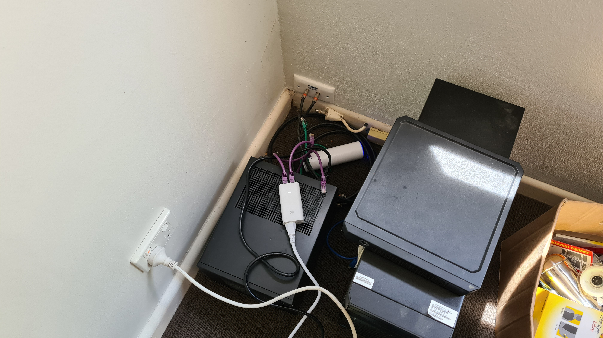
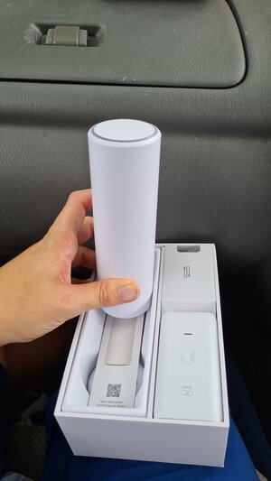
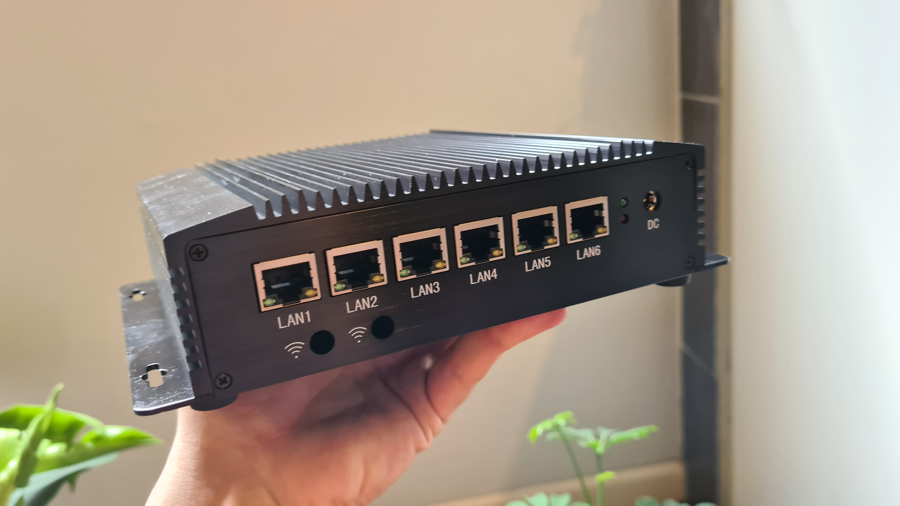

After relocating around Melbourne multiple times during 2020 (pandemic - long story) and finally settling into my own place with FTTC, I decided it was time to revive the home lab.  Previously back in Newcastle, my homelab comprised of:
1. HP MicroServer Gen 8 (running Proxmox)
2. HP ML10v2 (a playground/sandpit host of sorts - jumping between Hyper-V and Proxmox)
3. HP PS1810-8G managed switch
4. Some really crappy, locked all-in-one router device thing from my ISP (I cannot remember the model)

After FTTC NBN was finally connected - a drama in itself (another long story) - and after deliberating on Point 4, I decided it made sense to opt for something a little more prosumer grade.  I've had a longer term interest in homelab tinkering and InfoSec, on top of Development and DevOps things, and simply wanted to Do Things Right&trade;

My ideal setup is the ability to easily create multiple VLANs (which I'll cover in a future blog), and multiple SSIDs, tagging each with a specific VLAN.  This way, I can keep my untrusted IoT devices on their own VLAN with internet access only, and trusted devices (phones, laptops) on a separate VLAN with more freedom.  My existing HP MicroServer and ML10V2 run VLAN trunks across the HP switch, and I can readily assign virtual machines to different VLAN IDs, so doing the same for my SSIDs is ideal -- again, I'll cover specifics of my setup later and why I wanted this flexibility.

Enter the first upgrade - The Tin Can - otherwise known as the Ubiquiti FlexHD:

I originally looked at the [UniFi Dream Machine](https://store.ui.com/products/unifi-dream-machine), but the IDS/IPS capabilities seemed somewhat limited, as did the lack of other advanced features.  The Unifi AP variants were also considered, but the form factor seemed more suited to mounting on a wall or roof.  Besides, who could turn down a wireless access point that resembles a coke can?

Next up, after deciding on pfSense as a router/firewall, mostly to play around with IDS/IPS (Suricata) and other packages, I started looking at appliances.  The pfSense reddit seems to indicate Protectli and some other pfSense appliances were actually Qotom, Yanling or Minisys mini PCs as found on AliExpress.  A quick search on AliExpress for 'pfsense' shows many upon many clones of clones of clones of mini PCs with anywhere from 2-6 Intel NICs.  I eventually settled on the Topton, a passively cooled mini PC perfectly suited as a router/firewall:

Specs:
* Intel Core i5 8265U (so includes AES-NI)
* 6 Intel NICs
* 128 GB SSD
* 16GB RAM
  
It's total overkill, but great value for what I paid (around $540 AUD including shipping) for the specs.  At this point, I had decided I would virtualise pfSense and pass through a NIC bridged to the NBN FTTC box, given I needed to run the Unifi Network Controller in a separate virtul machine and wasn't keen on cloud hosted.

I think this was the point where I had decided on 16GB RAM, the maximum available at purchase, and 128 GB SSD -- with a spare SATA bay for extra storage if required.  I would be running this devices as an edge router/firewall, Unifi Network Controller for managing my FlexHD, and with spare resources for any other network appliances I decide on..

In the next part, I'll cover my basic strategy around configuration, network segmentation, etc.