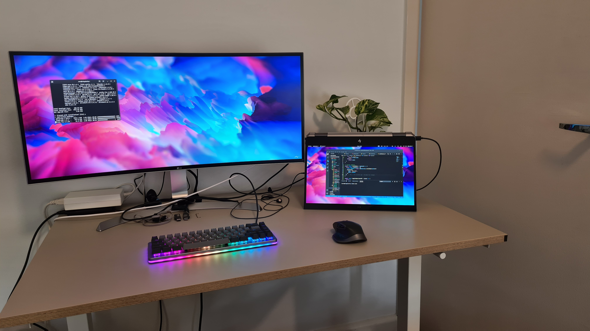
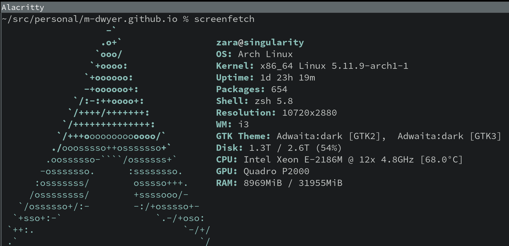

The last several months have seen me moving around.. A lot (thanks COVID)..  But after hunting around for furniture due to a shortage of standing desks, I've finalised my setup -- and thank god.

## Setup

It's been great to revive my Ultrawide and laptop in a fairly minimalist setup.  This is my primary dev machine which, if you see my GitHub, has caused no end of issues with running Linux (#YearOfTheLinuxDesktop) in the 2 years I've had it.  My setup from the photo above:

1. HP Zbook x360 G5 2-in-1 laptop running Arch.  Screenfetch shows my config:

2. LG 34UC99-W monitor
3. Drop Alt keyboard (Halo Clears for now)
4. Logitech MX Master 2S Mouse
5. A beautiful Marble Queen Pothos for good measure

My development is all local, baremetal (for now) with vscode and browser usually tiled on the Ultrawide, and an extra terminal on my laptop display for running tests or other things requiring more screen real estate outside of vscode's terminal.  I'll most definitely elaborate on my setup more in a future post.

## Studies

My focus since moving to Melbourne has been a combination of React, Node, Express, GraphQL and MongoDB - a fairly big change from the last several years I've spent on mostly back end Ruby development, surrounding test automation frameworks and CI/CD.

Let's keep in mind I've been moving to full stack and not looked at anything web since my degree an embarassing number of years ago. Back then, it was raw HTML, CSS and a bit of jQuery.. And maybe some Bootstrap.  My memory is hazy - it was a while ago!  Let's just say I've had a lot of catching up to do - UI frameworks, CSS-in-JS frameworks, bundlers, various other tooling..

So, how has my journey looked?

1. [FreeCodeCamp](https://www.freecodecamp.org/)
2. [FullStackOpen](https://fullstackopen.com/en/)
3. Projects!

I initially completed all the FreeCodeCamp certificates, but became a little bored of coding in a browser, and was after something a little more comprehensive and 'real world'.  [FullStackOpen](https://fullstackopen.com/en/) filled the gap really nicely.

While FreeCodeCamp focuses on JavaScript basics, FullStackOpen was a great way to quickly come up to speed with the JavaScript ecosystem, and learn how to set up React projects, some WebPack, Node & Express backends and some GraphQL.  Oh, and writing unit tests for React components (react-testing-library), and cypress for e2e integration tests? Excellent.  Redux? Great! Linting? Awesome!

I felt the jumping between projects throughout the course contents and exercises to be a little jarring and confusing at times (and not so obvious), but being able to create a full stack application from end to end, and mocking out certain components yet to be developed was a great way to get up to speed and provided a structured approach from both a bird's-eye and on-the-ground-running view -- a perfect balance.

## Projects

I've now started up a full stack project - [exertion](https://github.com/m-dwyer/exertion-app) - yet another fitness tracker.  I'm also seemingly forever revising this Gatsby site, which I started from scratch.  Reinventing the wheel is obviously not the best of ideas, however it's been a great look into using a static site generator, writing React components, creating my own front end from scatch (this is where I struggle most) and a little GraphQL.

A part of me feels using a Gatsby starter would have been wise, but it has been enjoyable and educational coding it all from scratch. The caveat, of course, is that I still have much to do - particularly applying UI design principles around alignment, whitespace, typography etc - in order to add further polish to my site.

For me, this is not only continuing to evolve my CSS skills, but also bridging the gap between being identifying *if* a site's UI design is aesthetically pleasing or not and understanding *why* and *how* it looks great, then subsequently what styling is required to achieve this.

## Next Steps

My next steps are to continue [my app](https://github.com/m-dwyer/exertion-app), and look at Next.js.  The tooling, particularly WebPack, has definitely caused a little friction and not provided the best developer experience.  I've definitely had some fun with WebPack, setting up Babel, getting Jest to work with Babel, etc - so trying out Next.js and some of its features such as code splitting, server side rendering etc looks like a great path forward.